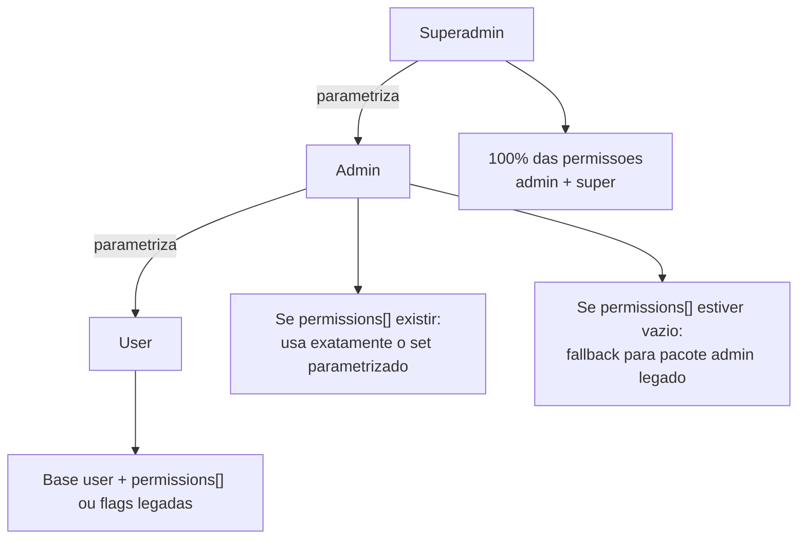
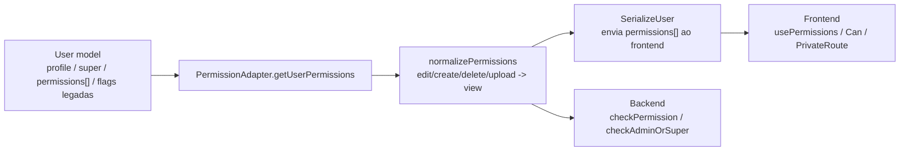
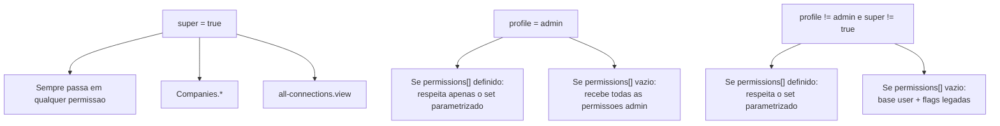
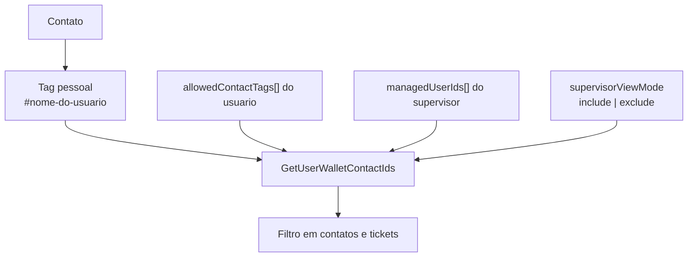
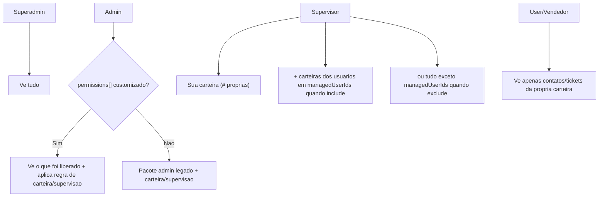
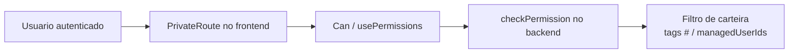
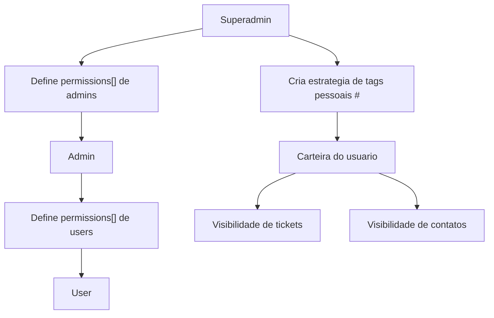

# Mapa Visual de Permissoes

Data de referencia: 2026-03-13

Este mapa representa o estado atual das permissoes apos os ajustes em backend e frontend.

## 1. Hierarquia efetiva

## 2. Fonte de verdade das permissoes

## 3. Regra atual por perfil

## 4. Carteiras e visibilidade de contatos/tickets

Carteira = contatos que possuem pelo menos uma tag pessoal com prefixo `#`.

### Resultado esperado da carteira

## 5. Camadas de bloqueio

Leitura do fluxo:

- `PrivateRoute` bloqueia o acesso antes de renderizar paginas sensiveis.
- `Can` e `usePermissions` escondem botoes e acoes no frontend.
- `checkPermission` protege as rotas da API.
- `GetUserWalletContactIds` restringe visibilidade operacional por carteira.

## 6. Modulos protegidos por permissao

```mermaid
flowchart TD
  ROOT["Permissoes do sistema"]

  ROOT --> T["Tickets"]
  ROOT --> C["Contatos"]
  ROOT --> CAMP["Campanhas"]
  ROOT --> FLOW["Flowbuilder"]
  ROOT --> MOD["Modulos"]
  ROOT --> ADM["Administracao"]
  ROOT --> SUP["Super"]

  T --> T1["tickets.view/create/update/transfer/close/delete"]
  T --> T2["tickets.view-all / view-groups / view-all-historic / view-all-users"]

  C --> C1["contacts.view/create/edit/delete/import/export/bulk-edit"]
  C --> C2["contacts.edit-fields / edit-tags / edit-wallets / edit-representative"]
  C --> C3["tags.view/create/edit/delete"]

  CAMP --> CP1["campaigns.view/create/edit/delete"]
  CAMP --> CP2["contact-lists.view/create/edit/delete"]
  CAMP --> CP3["campaigns-config.view"]

  FLOW --> F1["flowbuilder.view/create/edit/delete"]
  FLOW --> F2["phrase-campaigns.view/create/edit/delete"]

  MOD --> M1["kanban.view"]
  MOD --> M2["schedules.view/create/edit/delete"]
  MOD --> M3["internal-chat.view / integrations.view / prompts.* / ai-agents.* / ai-training.view"]
  MOD --> M4["announcements.view/create/edit/delete"]

  ADM --> A1["users.view/create/edit/delete"]
  ADM --> A2["queues.view/create/edit/delete"]
  ADM --> A3["connections.view/create/edit/delete"]
  ADM --> A4["files.view/upload/delete"]
  ADM --> A5["financeiro.view / settings.view/edit / ai-settings.view/edit"]

  SUP --> S1["companies.view/create/edit/delete"]
  SUP --> S2["all-connections.view"]
```

## 7. Rotas frontend hoje com bloqueio antecipado

Rotas principais ja cobertas por `PrivateRoute`:

- `/companies`, `/financeiro`, `/connections`, `/quick-messages`
- `/schedules`, `/tags`, `/contacts`, `/contacts/import`, `/groups`
- `/helps`, `/users`, `/settings`, `/queues`, `/reports`
- `/queue-integration`, `/announcements`, `/phrase-lists`
- `/flowbuilders`, `/flowbuilder/:id?`, `/files`
- `/Kanban`, `/TagsKanban`, `/allConnections`
- `/ai-settings`, `/ai-agents`, `/ai-training`
- `/contact-lists`, `/contact-lists/:contactListId/contacts`
- `/campaigns`, `/campaign/:campaignId/detailed-report`, `/campaigns-config`

Rotas centrais que continuam por autenticacao simples:

- `/`
- `/tickets/:ticketId?`
- `/chats/:id?`
- `/moments`
- `/messages-api`
- tutoriais em `/helps/...`

Nesses casos, a seguranca principal continua no backend e nas checagens internas da tela.

## 8. Resumo operacional

