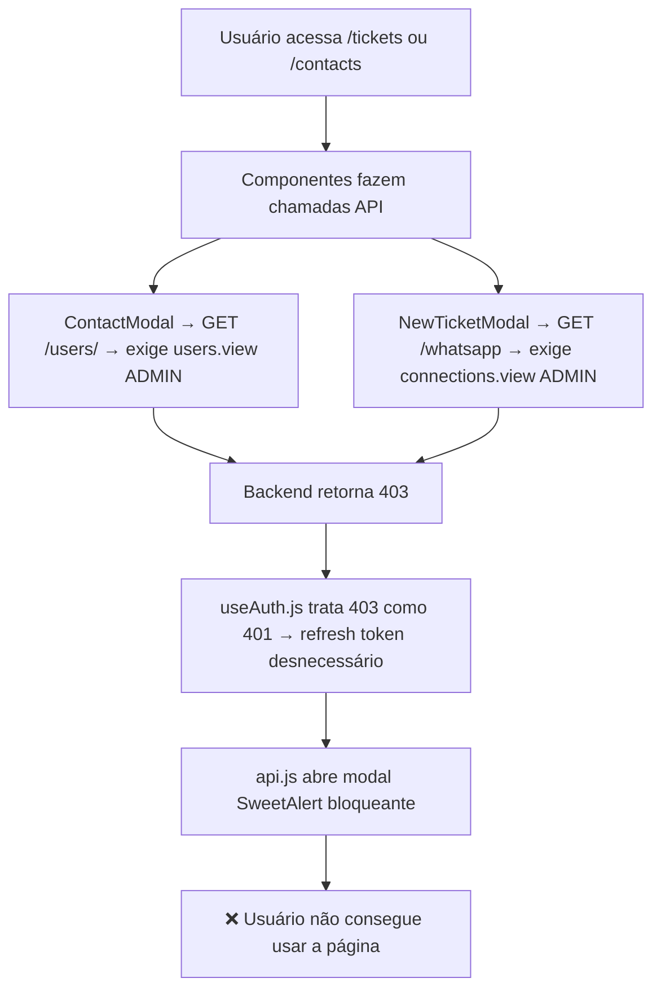
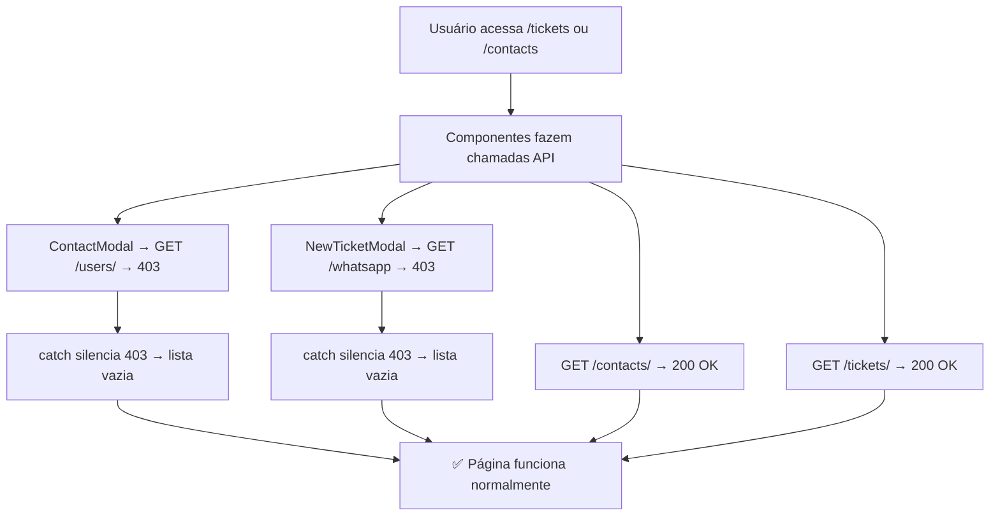

# 🔐 Correção de Permissões — Páginas /tickets e /contacts

**Data**: 11/03/2026  
**Status**: ✅ CORRIGIDO

## 🎯 Problema

Usuários normais não conseguiam acessar `/tickets` e `/contacts` mesmo com permissões configuradas. Modais de "Sem Permissão" apareciam bloqueando a interface.

## 🔍 Causa Raiz — 4 Problemas em Cascata

## ✅ Correções Aplicadas

### 1. `frontend/src/services/api.js`
- **Removido** interceptor global SweetAlert que abria modal para TODO erro 403
- Agora cada componente trata 403 individualmente via `toastError()`

### 2. `frontend/src/hooks/useAuth.js/index.js`  
- **Corrigido** interceptor para tratar apenas 401 (não mais 403)
- 403 = sem permissão, não precisa refresh de token

### 3. `frontend/src/components/ContactModal/index.js`
- `fetchUsers()`: silencia erro 403 (lista de Carteira fica vazia)
- `handleSaveContact()`: permanece com `toastError()` normal

### 4. `frontend/src/components/NewTicketModal/index.js`
- Fetch de `/whatsapp`: silencia erro 403 (lista de conexões fica vazia)

## 📋 Fluxo Corrigido

## 🔍 Como Testar

1. Login como **usuário normal** com `tickets.view` e `contacts.view`
2. Acessar `/tickets` → deve carregar sem erros
3. Abrir "Novo Ticket" → modal funciona (conexões podem estar vazias)
4. Acessar `/contacts` → lista carrega normalmente
5. Editar contato → modal funciona (Carteira pode estar vazia)
6. Login como **admin** → tudo continua funcionando

## 📚 Arquivos Modificados

| Arquivo | Tipo de Mudança |
|---------|----------------|
| `frontend/src/services/api.js` | Removido interceptor SweetAlert |
| `frontend/src/hooks/useAuth.js/index.js` | Removido 403 do refresh token |
| `frontend/src/components/ContactModal/index.js` | Silencia 403 no fetchUsers |
| `frontend/src/components/NewTicketModal/index.js` | Silencia 403 no fetch whatsapps |
