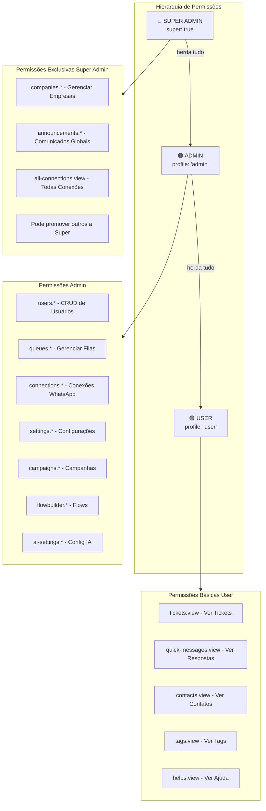
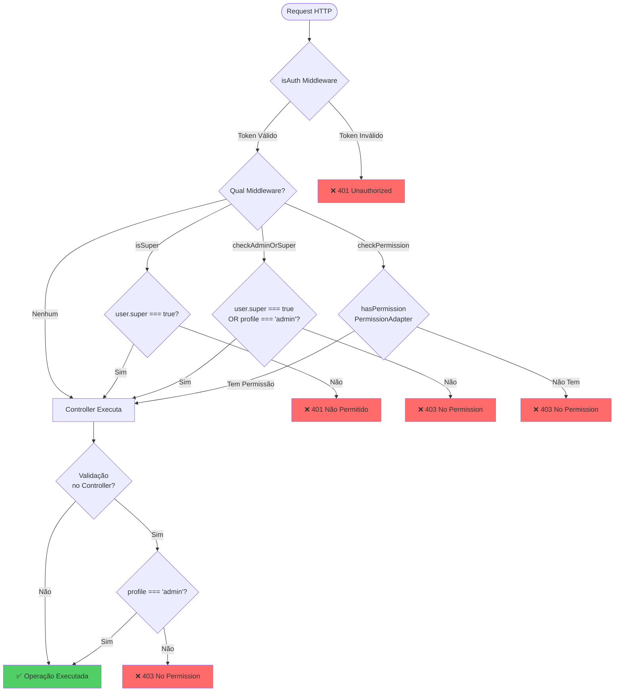
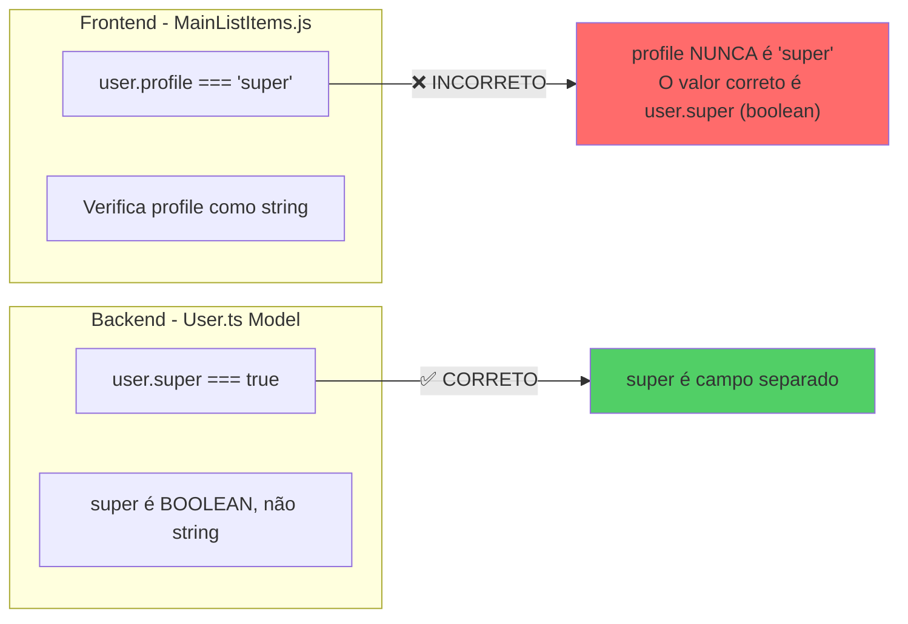
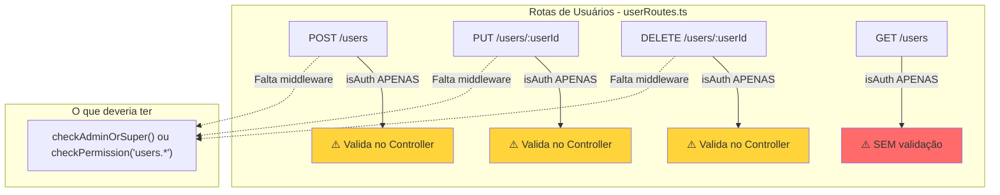
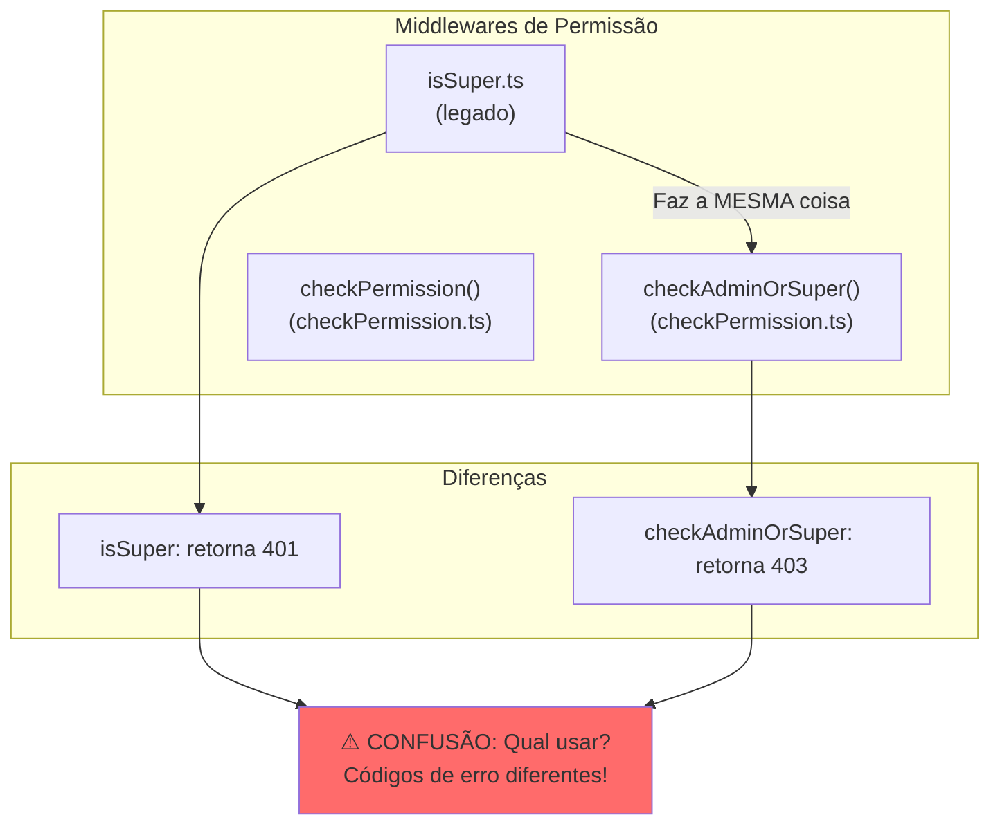
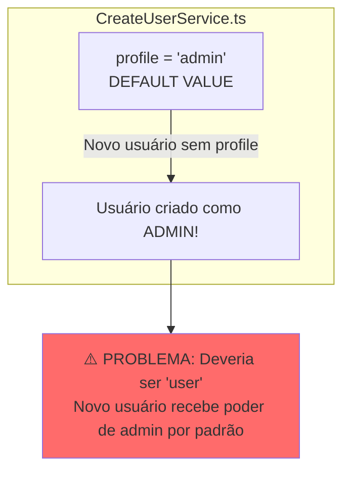
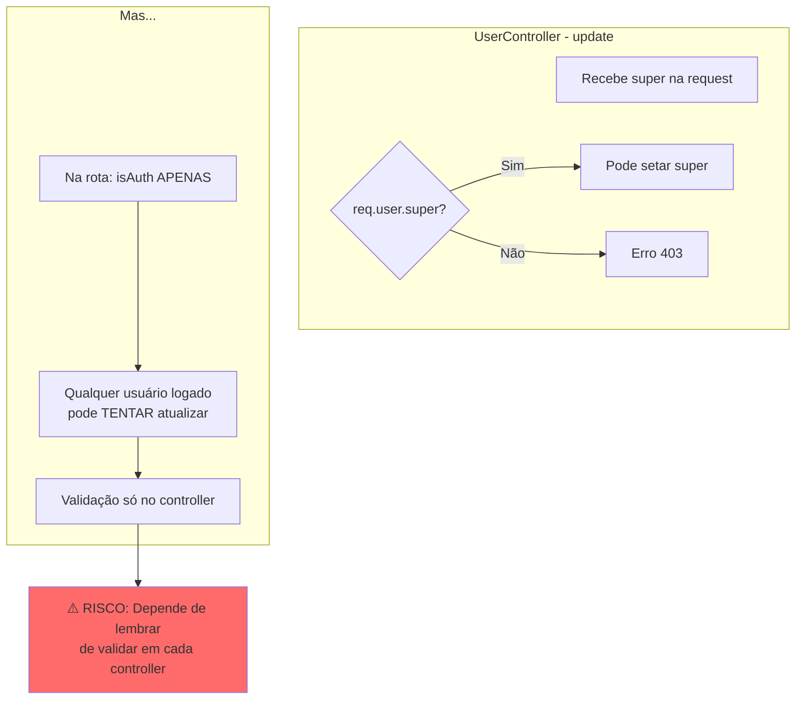
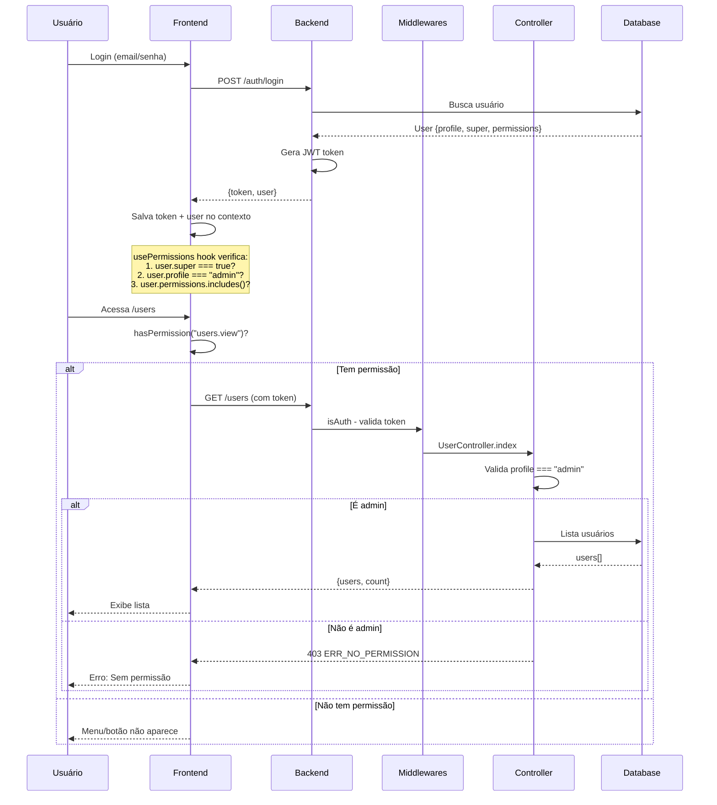
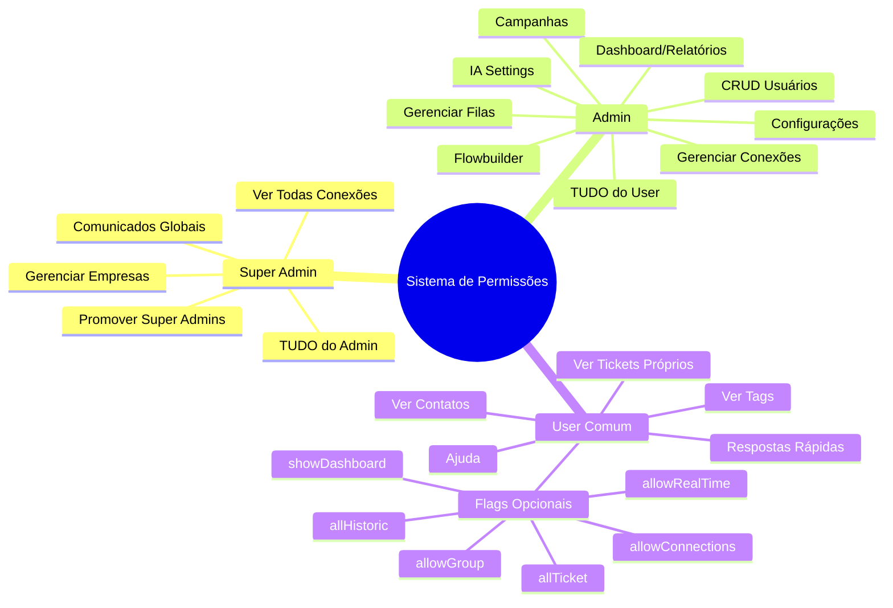

# Análise Completa: Sistema de Permissões de Usuários

> **Data:** 28/01/2026  
> **Objetivo:** Mapear o fluxo de permissões (user, admin, super admin) e identificar lógicas incorretas

---

## 📊 Visão Geral do Sistema de Permissões

O sistema utiliza uma **hierarquia de 3 níveis** baseada em dois campos principais:

| Campo     | Tipo    | Valores             | Descrição                |
| --------- | ------- | ------------------- | ------------------------ |
| `profile` | string  | `"user"`, `"admin"` | Perfil básico do usuário |
| `super`   | boolean | `true`, `false`     | Flag de Super Admin      |

---

## 🔷 Mapa de Hierarquia de Permissões



---

## 🔶 Fluxo de Verificação de Permissões (Backend)



---

## ⚠️ Problemas Identificados

### 🔴 Problema 1: Inconsistência Frontend vs Backend



**Localização do Problema:**
- [MainListItems.js:455](file:///c:/Users/feliperosa/whaticket/frontend/src/layout/MainListItems.js#L455): `user.profile === "admin" || user.profile === "super"`
- [MainListItems.js:465](file:///c:/Users/feliperosa/whaticket/frontend/src/layout/MainListItems.js#L465): mesma lógica incorreta
- [MainListItems.js:764](file:///c:/Users/feliperosa/whaticket/frontend/src/layout/MainListItems.js#L764): mesma lógica incorreta

**Impacto:** Menus que deveriam aparecer apenas para super admin **nunca aparecem** porque `profile` nunca é `"super"`.

---

### 🔴 Problema 2: Rotas sem Proteção Adequada



**Problema:** As rotas de usuários dependem de validação **dentro do controller** ao invés de usar middlewares. Isso é:
1. Menos seguro (se alguém esquecer a validação no controller)
2. Inconsistente com outras rotas que usam middlewares

---

### 🔴 Problema 3: Middlewares Duplicados/Conflitantes



**Localização:**
- [isSuper.ts](file:///c:/Users/feliperosa/whaticket/backend/src/middleware/isSuper.ts)
- [checkPermission.ts](file:///c:/Users/feliperosa/whaticket/backend/src/middleware/checkPermission.ts)

---

### 🔴 Problema 4: Lógica de Criação de Usuário com Valor Default Incorreto



**Localização:** [CreateUserService.ts:52](file:///c:/Users/feliperosa/whaticket/backend/src/services/UserServices/CreateUserService.ts#L52)

```typescript
profile = "admin", // ❌ Deveria ser "user"
```

---

### 🔴 Problema 5: Validação Inconsistente de Super Admin



---

## 📋 Fluxo Completo de Autenticação e Autorização



---

## 🎯 Mapa de Permissões por Funcionalidade



---

## ✅ Resumo das Correções Necessárias

| #   | Problema                        | Arquivo                | Correção                                    |
| --- | ------------------------------- | ---------------------- | ------------------------------------------- |
| 1   | `profile === "super"` incorreto | `MainListItems.js`     | Trocar para `user.super === true`           |
| 2   | Rotas sem middleware            | `userRoutes.ts`        | Adicionar `checkPermission("users.*")`      |
| 3   | Middlewares duplicados          | `isSuper.ts`           | Depreciar e usar apenas `checkAdminOrSuper` |
| 4   | Default profile "admin"         | `CreateUserService.ts` | Mudar para `"user"`                         |
| 5   | Validação só no controller      | Vários                 | Mover validações para middlewares           |

---

## 📁 Arquivos Analisados

- [User.ts](file:///c:/Users/feliperosa/whaticket/backend/src/models/User.ts) - Model de usuário
- [PermissionAdapter.ts](file:///c:/Users/feliperosa/whaticket/backend/src/helpers/PermissionAdapter.ts) - Sistema de permissões granulares
- [checkPermission.ts](file:///c:/Users/feliperosa/whaticket/backend/src/middleware/checkPermission.ts) - Middlewares de verificação
- [isSuper.ts](file:///c:/Users/feliperosa/whaticket/backend/src/middleware/isSuper.ts) - Middleware legado
- [UserController.ts](file:///c:/Users/feliperosa/whaticket/backend/src/controllers/UserController.ts) - Controller de usuários
- [userRoutes.ts](file:///c:/Users/feliperosa/whaticket/backend/src/routes/userRoutes.ts) - Rotas de usuários
- [CreateUserService.ts](file:///c:/Users/feliperosa/whaticket/backend/src/services/UserServices/CreateUserService.ts) - Serviço de criação
- [usePermissions.js](file:///c:/Users/feliperosa/whaticket/frontend/src/hooks/usePermissions.js) - Hook de permissões (frontend)
- [MainListItems.js](file:///c:/Users/feliperosa/whaticket/frontend/src/layout/MainListItems.js) - Menu lateral
