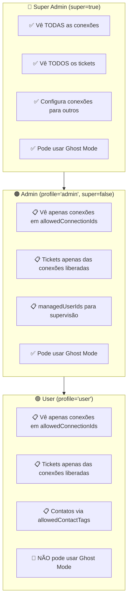
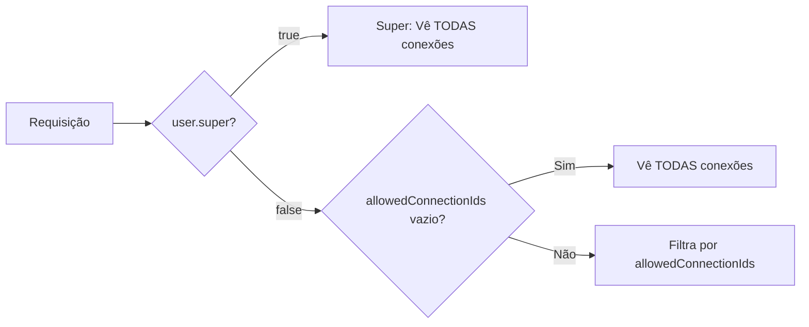

# 📋 Mapa Completo de Permissões de Usuários - Whaticket

> **Data da Análise:** 2026-02-03  
> **Atualizado:** 2026-02-03 13:40  
> **Status:** ✅ Correções implementadas

---

## ✅ Correções Implementadas

### 1. Filtro de Conexões para Admins não-Super

**Problema:** Admins viam todas as conexões, ignorando `allowedConnectionIds`

**Solução:** Mudança da condição `profile !== "admin"` para `!user.super`

| Arquivo | Status |
|---------|--------|
| [WhatsAppController.ts](file:///c:/Users/feliperosa/whaticket/backend/src/controllers/WhatsAppController.ts) | ✅ Corrigido |
| [ListTicketsService.ts](file:///c:/Users/feliperosa/whaticket/backend/src/services/TicketServices/ListTicketsService.ts) | ✅ Corrigido |
| [ListTicketsServiceKanban.ts](file:///c:/Users/feliperosa/whaticket/backend/src/services/TicketServices/ListTicketsServiceKanban.ts) | ✅ Corrigido |

---

### 2. Ghost Mode - Removido da Lista de Usuários

**Problema:** Ghost Mode ocultava o usuário da lista (incorreto)

**Solução:** Removido filtro isPrivate dos serviços de listagem de usuários

| Arquivo | Status |
|---------|--------|
| [ListUsersService.ts](file:///c:/Users/feliperosa/whaticket/backend/src/services/UserServices/ListUsersService.ts) | ✅ Corrigido |
| [SimpleListService.ts](file:///c:/Users/feliperosa/whaticket/backend/src/services/UserServices/SimpleListService.ts) | ✅ Corrigido |

---

## 📊 Hierarquia de Permissões (Corrigida)

---

## 🔄 Novo Fluxo de Permissões

### Filtro de Conexões

### Ghost Mode (Comportamento Correto)

| Local | Ghost Mode Aplica? | Resultado |
|-------|-------------------|-----------|
| Lista de Usuários | ❌ NÃO | Usuários Ghost aparecem normalmente |
| Lista de Tickets | ✅ SIM | Tickets de Ghost são ocultos |
| Kanban | ✅ SIM | Tickets de Ghost são ocultos |

---

## 📋 Campos de Permissões do Modelo User

### Perfil Base
| Campo | Tipo | Descrição |
|-------|------|-----------|
| `profile` | string | `admin` ou `user` |
| `super` | boolean | Super Admin (acesso total) |
| `isPrivate` | boolean | Ghost Mode (oculta tickets) |

### Hierarquia/Supervisão
| Campo | Tipo | Descrição |
|-------|------|-----------|
| `allowedConnectionIds` | number[] | Conexões WhatsApp permitidas |
| `allowedContactTags` | number[] | Tags de contato (carteira) |
| `managedUserIds` | number[] | Usuários supervisionados |
| `supervisorViewMode` | string | `include` ou `exclude` |

---

## ✅ Resumo das Correções

| # | Correção | Arquivos | Status |
|---|----------|----------|--------|
| 1 | Filtro de conexões para não-super | 3 arquivos | ✅ |
| 2 | Ghost Mode na lista de usuários | 2 arquivos | ✅ |
| 3 | Build do backend | - | ✅ |

**Build:** Exit code 0 ✅
