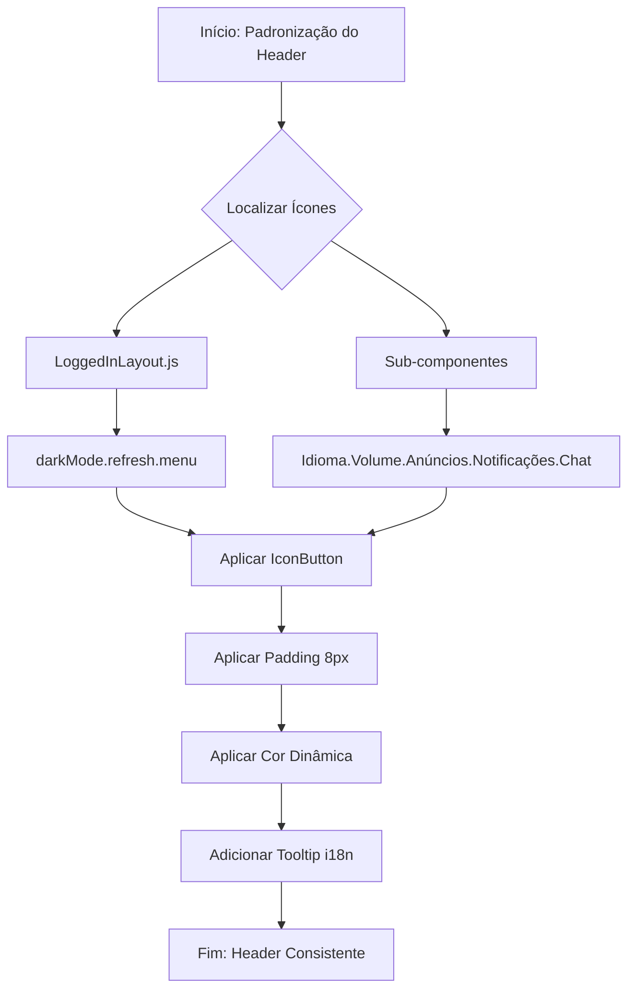

# Walkthrough de Melhorias na Interface do Usuário

Concluí a padronização visual e funcional do header e de outros elementos da interface, focando em consistência e usabilidade.

## 📊 Mapa de Fluxo da Padronização do Header

## 🎨 Padronização do Header (Ações Superiores)

Todos os ícones da barra superior foram unificados para seguir o mesmo padrão visual, facilitando a navegação e o entendimento das funções.

### Alterações Realizadas:
- **Estilo de Botão**: Converti o seletor de idiomas de `Button` simples para `IconButton`, mantendo a simetria com os outros ícones.
- **Espaçamento Centralizado**: Todos os ícones agora possuem um padding fixo de `8px`, garantindo que fiquem perfeitamente alinhados e com a mesma área de clique.
- **Cores Dinâmicas**: Implementei lógica de cor que se adapta ao tema:
  - **Modo Moderno**: Cores baseadas em `var(--text)`.
  - **Modo Clássico**: Cor branca para contraste com a barra superior colorida.
- **Tooltips 100% Traduzidos**: Adicionei componentes de `Tooltip` (balões de ajuda) em cada ícone com traduções em Português-BR para as seguintes funcionalidades:
  - Expandir/Recolher Menu
  - Idiomas
  - Alternar Tema (Claro/Escuro)
  - Volume das Notificações
  - Atualizar Página
  - Notificações de Tickets
  - Anúncios
  - Chat Interno

## 🧩 Correções no Dashboard e Tipografia

- **Traduções NPS**: Corrigi os termos técnicos "prosecutors" e "neutral" que apareciam no Dashboard, substituindo por "Promotores" e "Neutro".
- **Reset de Tipografia**: Apliquei uma regra CSS global em `modern-ui.css` para forçar que todos os componentes `Typography` herdem a fonte do projeto (`jakarta sans`), removendo o estilo "Roboto" padrão do Material-UI.

## 📁 Arquivos Modificados
- [pt.js](file:///C:/Users/feliperosa/whaticket/frontend/src/translate/languages/pt.js): Adição de chaves de tradução.
- [LoggedInLayout.js](file:///C:/Users/feliperosa/whaticket/frontend/src/layout/index.js): Padronização de tooltips e estilos centrais.
- [UserLanguageSelector.js](file:///C:/Users/feliperosa/whaticket/frontend/src/components/UserLanguageSelector/index.js): Refatoração completa para IconButton.
- [NotificationsVolume.js](file:///C:/Users/feliperosa/whaticket/frontend/src/components/NotificationsVolume/index.js): Inclusão de Tooltip e cor dinâmica.
- [AnnouncementsPopover.js](file:///C:/Users/feliperosa/whaticket/frontend/src/components/AnnouncementsPopover/index.js): Inclusão de Tooltip e cor dinâmica.
- [NotificationsPopOver.js](file:///C:/Users/feliperosa/whaticket/frontend/src/components/NotificationsPopOver/index.js): Inclusão de Tooltip e cor dinâmica.
- [ChatPopover.js](file:///C:/Users/feliperosa/whaticket/frontend/src/pages/Chat/ChatPopover.js): Inclusão de Tooltip e cor dinâmica.
- [modern-ui.css](file:///C:/Users/feliperosa/whaticket/frontend/src/modern-ui.css): Reset global de fontes.
