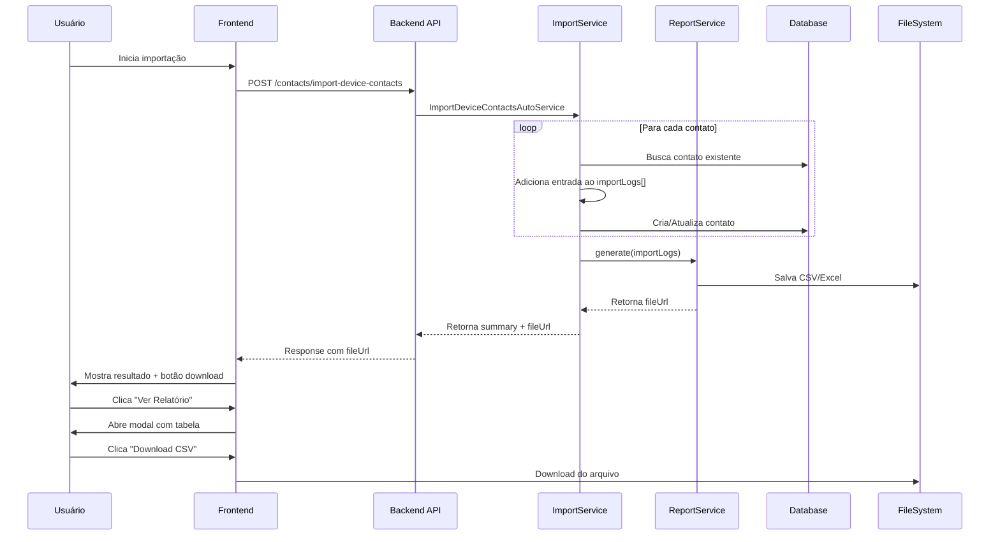

# Relatório Detalhado de Importação de Contatos

## Objetivo

Criar um sistema de relatório detalhado que registre o processamento de cada contato durante a importação, permitindo auditoria completa e diagnóstico de problemas.

## Estrutura do Relatório

### Colunas do Relatório CSV/Excel

| Coluna | Descrição | Exemplo |
|--------|-----------|---------|
| `#` | Número sequencial | 1, 2, 3... |
| `JID Original` | JID completo do WhatsApp | `556292761959@s.whatsapp.net` |
| `Número Extraído` | Número extraído do JID | `556292761959` |
| `Número Normalizado` | Número após normalização | `556292761959` |
| `Número Canônico` | Número no formato canonical | `556292761959` |
| `Nome do WhatsApp` | Nome no dispositivo | `João Silva` |
| [Status](file:///c:/Users/feliperosa/whaticket/backend/src/libs/whatsapp/BaileysAdapter.ts#408-422) | Resultado do processamento | `CRIADO`, `JÁ_EXISTIA`, `ATUALIZADO`, `FALHA`, `IGNORADO` |
| `Ação Realizada` | O que foi feito | `Tag aplicada`, `Contato criado`, `Nome atualizado` |
| `ID Banco` | ID do contato no banco | `12345` |
| `Nome no Banco` | Nome atual no banco | `João Silva` |
| `Método de Busca` | Como foi encontrado | `canonicalNumber`, `number`, `não encontrado` |
| `Critério de Match` | Campo que deu match | `canonicalNumber=556292761959` |
| `Tags Aplicadas` | Tags adicionadas | `Cliente, VIP` |
| `Erro (se houver)` | Mensagem de erro | `Validation error: number already exists` |
| [Timestamp](file:///c:/Users/feliperosa/whaticket/backend/src/services/WbotServices/wbotMessageListener.ts#203-206) | Data/hora do processamento | `2026-01-19 09:28:35` |

## Implementação

### Backend

#### 1. Interface de Log de Importação

```typescript
interface ImportContactLog {
  sequenceNumber: number;
  originalJid: string;
  extractedNumber: string;
  normalizedNumber: string;
  canonicalNumber: string | null;
  whatsappName: string;
  status: 'CREATED' | 'ALREADY_EXISTS' | 'UPDATED' | 'FAILED' | 'SKIPPED';
  action: string;
  contactIdInDb: number | null;
  nameInDb: string | null;
  searchMethod: 'canonicalNumber' | 'number' | 'not_found' | 'special_jid';
  matchCriteria: string | null;
  tagsApplied: string[];
  errorMessage: string | null;
  errorStack: string | null;
  timestamp: Date;
}
```

#### 2. Serviço de Geração de Relatório

**Arquivo**: `backend/src/services/ContactServices/ContactImportReportService.ts`

- Recebe array de logs da importação
- Gera CSV usando biblioteca `csv-writer` ou `xlsx`
- Salva arquivo temporário em `/tmp` ou retorna stream
- Opcionalmente envia por email ou disponibiliza para download

#### 3. Modificação do ImportDeviceContactsAutoService

**Mudanças necessárias**:

1. Criar array `importLogs: ImportContactLog[]` no início
2. Para cada contato processado, adicionar entrada detalhada ao log
3. Após conclusão, chamar `ContactImportReportService.generate(importLogs)`
4. Retornar URL do arquivo ou enviar via Socket.IO

### Frontend

#### Modal de Visualização de Relatório

**Componente**: `ContactImportReportModal`

**Features**:
- Tabela paginada com todos os registros
- Filtros por status (CRIADO, JÁ_EXISTIA, FALHA, etc.)
- Busca por número ou nome
- Botão para download do CSV/Excel completo
- Estatísticas resumidas no topo

#### Integração com ContactImportTagsModal

Após importação concluída:
1. Mostrar botão "📊 Ver Relatório Detalhado"
2. Ao clicar, abrir modal com tabela de logs
3. Permitir download do arquivo completo

## Exemplo de Logs Gerados

```csv
#,JID Original,Número Extraído,Número Normalizado,Número Canônico,Nome WhatsApp,Status,Ação Realizada,ID Banco,Nome no Banco,Método Busca,Critério Match,Tags Aplicadas,Erro,Timestamp
1,556292761959@s.whatsapp.net,556292761959,556292761959,556292761959,João Silva,JÁ_EXISTIA,Tag aplicada,12345,João Silva,canonicalNumber,canonicalNumber=556292761959,"Cliente,VIP",,2026-01-19 09:28:35
2,557499962150@s.whatsapp.net,557499962150,557499962150,557499962150,O Barateiro,CRIADO,Contato criado,12346,O Barateiro,not_found,,"Cliente",,2026-01-19 09:28:35
3,status@broadcast,,,,,IGNORADO,JID especial ignorado,,,special_jid,,,Broadcast não é contato válido,2026-01-19 09:28:35
4,5511999999999@s.whatsapp.net,5511999999999,5511999999999,5511999999999,Maria,FALHA,Tentativa de criação,,,not_found,,,"SequelizeUniqueConstraintError: number must be unique",2026-01-19 09:28:36
```

## Fluxo de Dados



## Verificação

### Casos de Teste

1. **Contato novo criado**
   - ✅ Status = CREATED
   - ✅ ID do banco preenchido
   - ✅ Método de busca = not_found

2. **Contato já existente**
   - ✅ Status = ALREADY_EXISTS
   - ✅ Método de busca = canonicalNumber ou number
   - ✅ Critério de match preenchido

3. **JID especial ignorado**
   - ✅ Status = SKIPPED
   - ✅ Método de busca = special_jid
   - ✅ Campos de banco vazios

4. **Erro de duplicação**
   - ✅ Status = FAILED
   - ✅ Mensagem de erro preenchida
   - ✅ Stack trace parcial

## Benefícios

1. **Auditoria Completa**: Rastreabilidade de cada operação
2. **Diagnóstico**: Identificar padrões de falhas
3. **Compliance**: Documentação de processamento de dados
4. **Transparência**: Usuário sabe exatamente o que aconteceu
5. **Debug**: Facilita identificação de problemas
