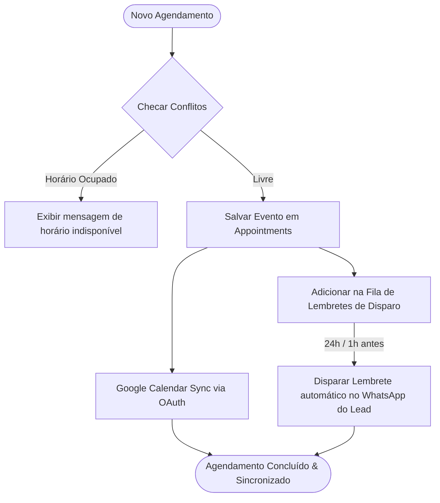
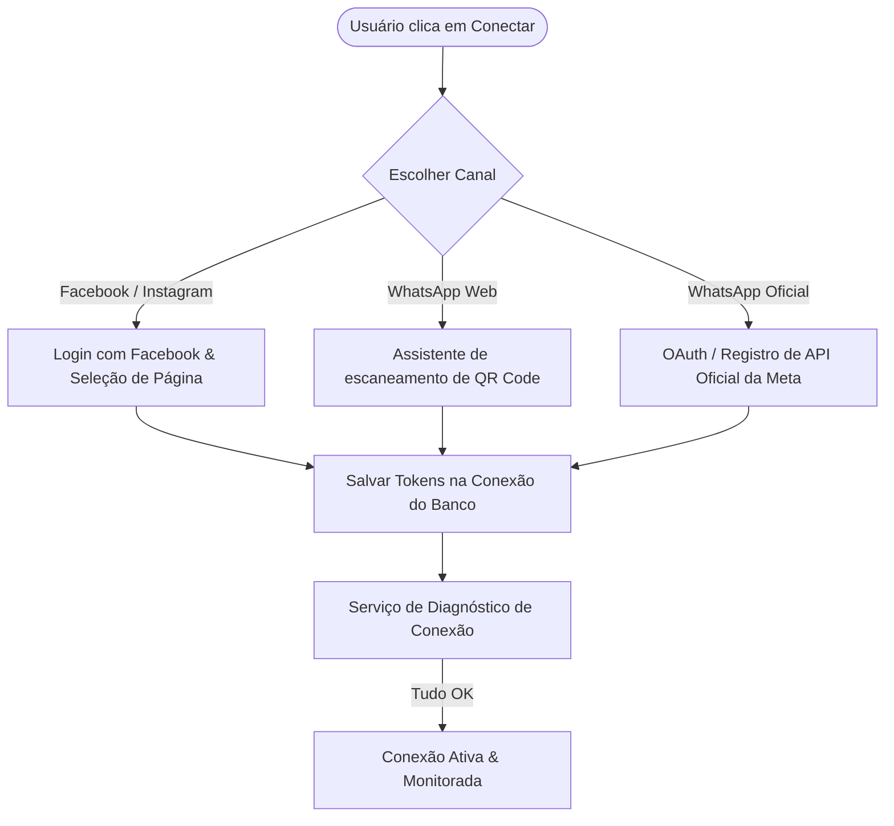

# Análise e Plano de Melhorias: Agenda e Conectores de Canais

Este documento apresenta o diagnóstico e as propostas de melhorias para o módulo de **Agenda** (compromissos) e para os **Conectores Multicanais** do Whaticket, baseado nas melhores práticas da Sellflux.

---

## 🗺️ Mapa de Fluxo da Nova Agenda de Compromissos (Flow Map)

O diagrama abaixo ilustra como funcionará o fluxo de agendamento de reuniões na nova agenda e sua sincronização externa:

---

## 1. Mapeamento e Diagnóstico da Agenda

### ⚠️ O Diagnóstico: Por que a Agenda atual é fraca?
Ao analisar o model [`Schedule.ts`](file:///c:/Users/feliperosa/whaticket/backend/src/models/Schedule.ts) do Whaticket, identificamos a causa raiz:
* **Não é uma agenda de compromissos:** O model `Schedule` serve exclusivamente para **agendar mensagens de WhatsApp para serem disparadas no futuro**. Ele possui colunas como `body`, `mediaPath`, `mediaName` e `sentAt`.
* **O que falta:** Falta uma modelagem de **calendário de reuniões e eventos** (como a Sellflux possui), que controle horários de atendentes, previna choque de horários e sincronize com serviços de calendário reais (Google Calendar).

### 🎯 Plano de Melhorias para a Agenda:
Para criar um módulo de agenda profissional no Whaticket, propomos a criação de duas novas entidades:

1. **Model `Appointment` (Eventos do Calendário):**
   * **Colunas:** `id`, `companyId`, `userId` (atendente), `contactId` (lead), `title`, `description`, `startAt` (data/hora início), `endAt` (data/hora fim), `googleEventId` (sincronizador), `status` (`scheduled`, `completed`, `no_show`, `canceled`, `rescheduled`, `overdue`).
2. **Model `CalendarBlock` (Bloqueio de Disponibilidade):**
   * **Colunas:** `id`, `userId`, `from` (início do bloqueio), `to` (fim do bloqueio), `reason` (almoço, folga, feriado).

#### Integração Técnica:
* **Google Calendar API:** Implementar autenticação OAuth2 para que cada atendente possa conectar seu Google Calendar. Quando uma reunião for marcada no Whaticket, ela é criada no Google Calendar, e vice-versa.
* **Disparo Automático de Lembretes:** Criar uma tarefa cron (Job no Bull/Redis) que verifique a tabela `Appointments` periodicamente. Faltando 24 horas (e 1 hora) para o compromisso, o sistema usa o robô de WhatsApp do Whaticket para enviar uma mensagem personalizada de lembrete ao cliente de forma 100% autônoma.

---

## 2. Mapeamento e Diagnóstico dos Conectores de Canais

O Whaticket já possui no backend a infraestrutura para rodar WhatsApp (Baileys/Web e Cloud API oficial) e Facebook/Instagram (Graph API da Meta no diretório [`backend/src/services/FacebookServices`](file:///c:/Users/feliperosa/whaticket/backend/src/services/FacebookServices)).

### ⚠️ O Diagnóstico: Por que os Conectores parecem frágeis?
* **UX Fragmentada:** No Whaticket, a tela de adicionar conexões mistura fluxos de escaneamento de QR Code com configurações difíceis de tokens do Facebook e da Cloud API do WhatsApp Cloud.
* **Falhas de Webhook:** A Meta atualiza a Graph API constantemente (atualmente na v18+). Falhas na renovação dos tokens de página (`facebookUserToken`) quebram a recepção de mensagens silenciosamente.

### 🎯 Plano de Melhorias para os Conectores:
Propomos redesenhar o fluxo de conexões no frontend e no backend seguindo o design limpo e assistido da Sellflux:

#### Melhorias Chaves:
1. **Assistente de Conexão Unificado (Wizard Frontend):** Criar uma tela com botões modernos contendo os logos do WhatsApp, Facebook, Instagram e Webchat. Ao clicar em um canal, abre-se um passo a passo (wizard) intuitivo de configuração.
2. **Health Check do Webhook (Autocorreção):** Adicionar um serviço em background que faça requisições de teste nas APIs do Facebook a cada 24 horas para garantir que o token de página (`facebookUserToken`) ou as permissões ainda são válidos. Se houver falha, notificar o administrador no Whaticket com um alerta visual.
3. **Página de Conexão WhatsApp Simplificada:** Implementar alertas e orientações amigáveis se a conexão cair (como na tela da Sellflux), permitindo reconexão rápida com um único clique.
