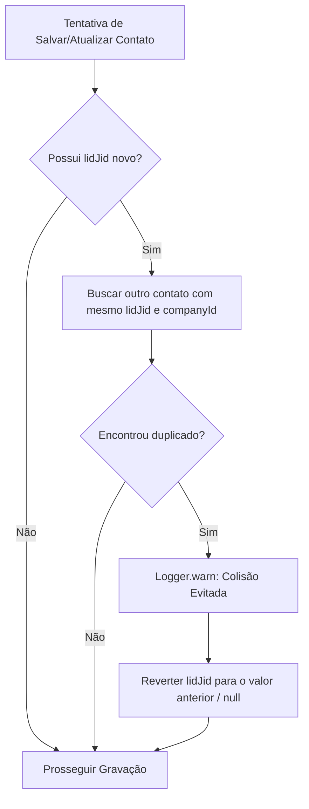
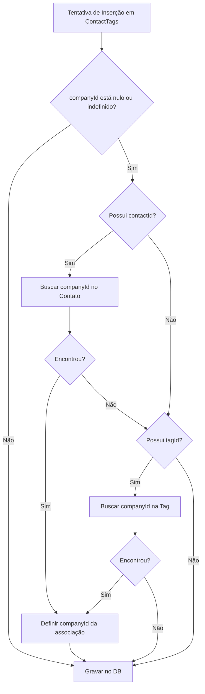
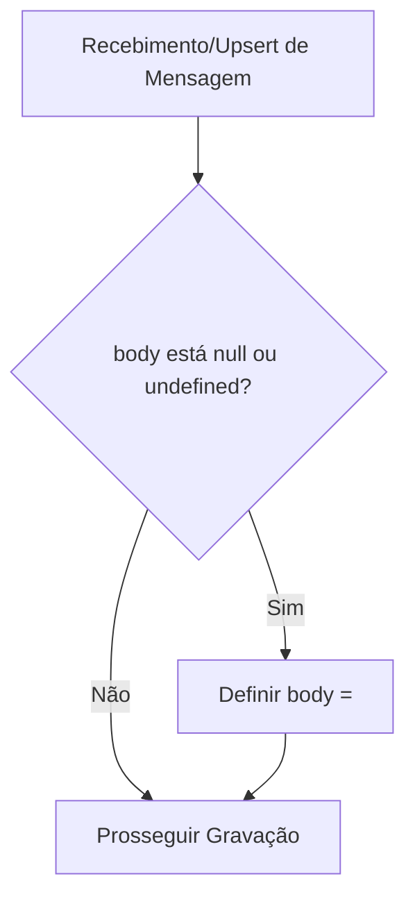

# 📋 ANÁLISE E RESOLUÇÃO DOS ERROS DE PERSISTÊNCIA - POSTGRESQL

**Modo:** N1 (Production)  
**Data:** 2026-07-10  
**Versão:** 1.0  

---

## 🎯 Objective (Objetivo)
Resolver preventivamente três bugs recorrentes na aplicação Whaticket que causam erros de restrição (constraint) no banco de dados PostgreSQL e abortam transações ativas em cascata.

1. **Duplicate key value violates unique constraint "contacts_lidjid_company_unique"**: Prevenir colisões de LIDs vinculando o mesmo LID do grupo a contatos distintos.
2. **Null value in column "companyId" of relation "ContactTags" violates not-null constraint**: Garantir que o campo `companyId` seja preenchido automaticamente ao associar tags a contatos.
3. **Null value in column "body" of relation "Messages" violates not-null constraint**: Garantir que mensagens sem corpo decifrável (ex: `secretEncryptedMessage`) tenham o corpo blindado como string vazia (`""`) em vez de falhar.

---

## 🗺️ Mapa de Fluxo das Soluções

### 1. Prevenção de Colisão de `lidJid` (`Contact.ts`)

### 2. Auto-preenchimento de `companyId` (`ContactTag.ts`)

### 3. Blindagem de Corpo de Mensagem (`Message.ts`)

---

## 📝 Plan (Plano de Ação)

### 1. Modelo `Contact.ts` (Resolução do Erro 1)
- Adicionar hook `@BeforeSave` chamado `avoidLidJidCollision`.
- Buscar no DB contatos ativos na mesma empresa com o mesmo `lidJid`.
- Se encontrado, anular o valor conflitante ou retornar ao valor anterior.

### 2. Modelo `ContactTag.ts` (Resolução do Erro 2)
- Adicionar hook `@BeforeValidate` chamado `checkCompanyId`.
- Identificar se `companyId` está nulo.
- Consultar `contactId` ou `tagId` associado no mesmo banco de dados para resolver o `companyId` correspondente antes da validação.

### 3. Modelo `Message.ts` (Resolução do Erro 3)
- Importar `@BeforeValidate` de `sequelize-typescript`.
- Adicionar hook `@BeforeValidate` chamado `checkBody`.
- Verificar se `body` é nulo/indefinido e substituí-lo por string vazia `""`.

---

## 🔒 Security & Data (Segurança e Integridade dos Dados)
- O PostgreSQL invalida transações se ocorrer algum erro de restrição. A prevenção preemptiva a nível de modelo garante que a transação principal de recepção de mensagens permaneça saudável mesmo se um contato receber um LID conflitante.
- Todas as buscas utilizam índices existentes (`companyId`, `lidJid` e chaves primárias), minimizando overhead no banco de dados.

---

## ⚙️ Rollback / Flags
- O rollback é feito removendo os hooks `@BeforeSave` e `@BeforeValidate` dos arquivos modificados.
- As mudanças são 100% retrocompatíveis.
