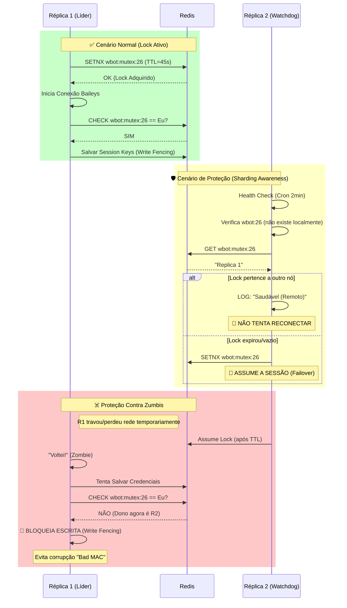

# Mapa Visual da Arquitetura Distribuída

Este diagrama ilustra como o sistema gerencia conexões do WhatsApp em um ambiente com múltiplas réplicas (Docker Swarm/Kubernetes), evitando conflitos e corrupção de dados.

## Fluxo de Controle de Lock e Proteção de Escrita

## O que foi resolvido?

1.  **Cabo de Guerra (Tug-of-War)**: Antes, a Réplica 2 via a sessão faltando *nela* e reiniciava, derrubando a Réplica 1. Agora ela respeita o Lock Remoto.
2.  **Corrupção de Sessão (Bad MAC)**: Antes, se a Réplica 1 "acordasse" achando que ainda era dona, ela sobrescrevia as chaves novas geradas pela Réplica 2. Agora o **Write Fencing** impede isso.
