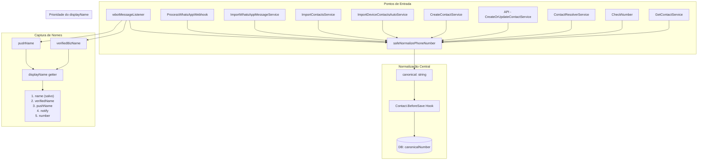

# Relatório de Auditoria: Normalização Global de Telefones & Refatoração de Contatos WhatsApp

## Objetivo
Garantir que **100% dos pontos de entrada de números** de telefone no backend passem pela normalização canônica via `libphonenumber-js`, e que contatos vindos do WhatsApp tenham captura completa de metadados.

---

## Mapa de Fluxo: Normalização de Números

## Cobertura Detalhada

### ✅ Serviços com Normalização Ativa (15/15)

| # | Arquivo | Tipo | Status |
|---|---------|------|--------|
| 1 | `CreateOrUpdateContactService.ts` | Core | ✅ |
| 2 | `CreateContactService.ts` | Core | ✅ |
| 3 | `ContactResolverService.ts` | Core | ✅ |
| 4 | `wbotMessageListener.ts` | Baileys | ✅ |
| 5 | `ProcessWhatsAppWebhook.ts` | Meta API | ✅ Migrado |
| 6 | `ImportWhatsAppMessageService.ts` | Importação | ✅ Migrado |
| 7 | `ImportContactsService.ts` | Importação | ✅ Migrado |
| 8 | `ImportDeviceContactsAutoService.ts` | Importação | ✅ |
| 9 | `GetContactService.ts` | Consulta | ✅ |
| 10 | `CheckNumber.ts` | Validação | ✅ |
| 11 | `CheckNumberOfficial.ts` | Validação | ✅ |
| 12 | `SendTemplateToContact.ts` | Envio | ✅ |
| 13 | `extractMessageIdentifiers.ts` | Resolução | ✅ |
| 14 | `ReconcilePendingContactsJob.ts` | Job | ✅ |
| 15 | `CreateOrUpdateContactServiceForImport.ts` | Import | ✅ |

### ⚪ Excluídos (não persistem números)

| Arquivo | Motivo |
|---------|--------|
| `GetBaileysContactDataService.ts` | Diagnóstico - só constrói JID para consulta |
| `SendWhatsAppMessage*.ts` | Comparação de nomes, sem persistência |
| `ResolveSendJid.ts` | Resolução de JID - leitura apenas |

### 🛡️ Camada de Proteção Final

O hook `BeforeSave` no modelo `Contact` aplica `safeNormalizePhoneNumber` automaticamente antes de qualquer `save()` ou `update()`. Isso funciona como **rede de segurança** para qualquer fluxo que venha a ser adicionado no futuro.

---

## Refatoração de Contatos WhatsApp

### Novos Campos no Modelo Contact
- **`pushName`**: Nome de notificação do WhatsApp do contato
- **`verifiedName`**: Nome verificado de conta Business
- **`notify`**: Nome da agenda do aparelho (wbot store)
- **`displayName`**: Getter virtual com lógica de prioridade

### Fluxo de Captura
1. **Mensagem recebida** → `wbotMessageListener` extrai `pushName` e `verifiedBizName` da mensagem
2. **CreateOrUpdateContactService** → Persiste `pushName` e `verifiedName` no banco
3. **ContactEnrichmentService** → Busca dados adicionais (business profile, store, etc.)
4. **displayName getter** → Frontend pode usar `contact.displayName` para obter o melhor nome disponível

### Validação
- **Build**: `npm run build` → exit code 0 ✅
- **Tipagem**: Zero erros TypeScript ✅
