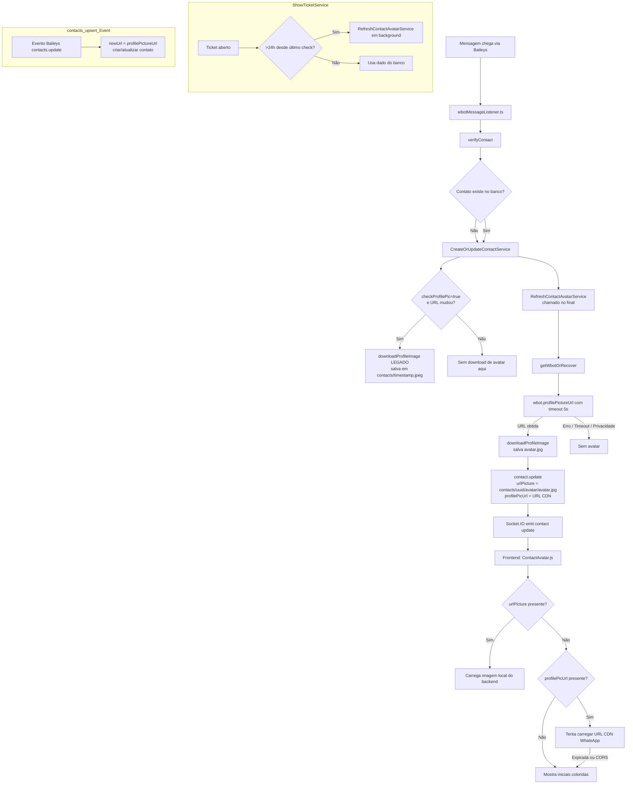
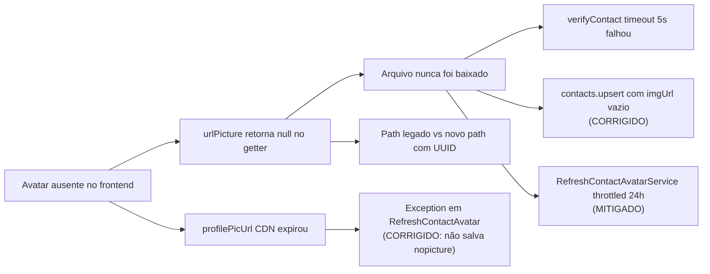

# 🖼️ Análise do Fluxo de Avatar de Contato — WhaTicket

> **Objetivo:** Entender por que alguns contatos não exibem avatar mesmo tendo foto no WhatsApp Web/Mobile.
> **Modo:** N1 (Production)

---

## 1. Fluxo Atual — Visão Geral



---

## 2. Análise Detalhada — Pontos de Falha

### Ponto 1 — `verifyContact`: timeout silencioso
**Arquivo:** `wbotMessageListener.ts` L2071–L2083

A busca de avatar tem timeout de 5s. Em caso de erro ou lentidão, `profilePicUrl = ""` e o contato é criado sem URL de avatar.

---

### Ponto 2 — `CreateOrUpdateContactService`: path legado
**Arquivo:** `CreateOrUpdateContactService.ts` L771–L781

O `downloadProfileImage` interno salva sem usar o UUID do contato:
- **Legado:** `contacts/1717001234567.jpeg`
- **Correto:** `contacts/<uuid>/avatar/avatar.jpg`

---

### Ponto 3 — `CreateOrUpdateContactService`: filename sem path completo
**Arquivo:** `CreateOrUpdateContactService.ts` L779

`urlPicture` é salvo apenas como o filename (ex: `"1717001234567.jpeg"`), não como caminho relativo completo.

---

### Ponto 4 — `RefreshContactAvatarService`: exception → nopicture ✅ CORRIGIDO
**Arquivo:** `RefreshContactAvatarService.ts` L300–L303

~~Em caso de exception no `profilePictureUrl`, atribuía `nopicture.png` à `newProfileUrl`, corrompendo o banco.~~

**Correção aplicada:** Em caso de exception, mantemos a URL anterior do contato e logamos o erro.

---

### Ponto 5 — `contacts.upsert`: ignora avatar se `imgUrl` vazio ✅ CORRIGIDO
**Arquivo:** `wbotMessageListener.ts` L7319–L7323

~~O evento Baileys `contacts.upsert` só buscava avatar se `imgUrl` estiver presente (indica mudança de foto). Contatos sincronizados sem mudança de foto não recebiam avatar.~~

**Correção aplicada:** Agora também busca avatar quando o contato não tem `urlPicture` local no banco, independente do `imgUrl`.

---

### Ponto 6 — `urlPicture` getter: retorna null se arquivo não existe ✅ MITIGADO
**Arquivo:** `Contact.ts` L401–L403

O getter faz `fs.existsSync()`. Se o arquivo não existe no disco → retorna `null` → frontend cai para CDN expirada.

**Mitigação aplicada no `RefreshContactAvatarService`:** O throttle agora é ignorado quando o arquivo referenciado no banco não existe fisicamente no disco, forçando nova tentativa de download.

---

### Ponto 7 — Frontend: URL CDN expirada não validada antes do uso
**Arquivo:** `ContactAvatar/index.js` L130–L137

URLs CDN do WhatsApp expiram em horas. O frontend as usa diretamente sem validar. O `onError` trata o erro, mas só após tentar carregar (delay visual).

---

## 3. Diagrama de Causa-Raiz



---

## 4. Status das Correções

| # | Descrição | Status | Arquivo Modificado |
|---|---|---|---|
| 5 | `contacts.upsert` busca avatar mesmo sem `imgUrl` | ✅ Aplicado | `wbotMessageListener.ts` |
| 4 | Não salva `nopicture.png` em `profilePicUrl` | ✅ Aplicado | `RefreshContactAvatarService.ts` |
| 6 | Throttle ignora se arquivo real não existe no disco | ✅ Aplicado | `RefreshContactAvatarService.ts` |
| 1 | verifyContact timeout — falha silenciosa | ⚠️ Pendente (tolerado) | — |
| 2 | Download legado path sem UUID | ⚠️ Pendente (baixo impacto) | — |
| 7 | Frontend: CDN expirada não pré-validada | ⚠️ Pendente (baixo impacto) | — |

---

## 5. Ações Pendentes (Próximas)

### Ação A — Cron para contatos sem avatar
Buscar periodicamente contatos com `urlPicture IS NULL` e canal `whatsapp`:

```typescript
const contacts = await Contact.findAll({
  where: {
    companyId,
    urlPicture: null,
    channels: { [Op.contains]: ['whatsapp'] }
  },
  limit: 20,
  order: [['updatedAt', 'ASC']]
});
for (const c of contacts) {
  await RefreshContactAvatarService({ contactId: c.id, companyId, whatsappId: c.whatsappId });
}
```

### Ação B — Frontend: pré-validar URL CDN antes de exibir
```javascript
if (isExternalUrl(imageUrl)) {
  try {
    const resp = await fetch(imageUrl, { method: 'HEAD', signal: AbortSignal.timeout(3000) });
    if (resp.ok) setBlobUrl(imageUrl);
    else setImageError(true);
  } catch {
    setImageError(true);
  }
  return;
}
```

---

## 6. Diagnóstico Rápido

### SQL — verificar avatar de um contato
```sql
SELECT id, name, number,
       LEFT(profile_pic_url, 80) AS profile_pic_url,
       LEFT(url_picture, 80) AS url_picture,
       picture_updated,
       updated_at
FROM "Contacts"
WHERE number LIKE '%5519XXXXXXXXX%'
   OR canonical_number LIKE '%19XXXXXXXXX%';
```

### Log — buscar erros de avatar
```bash
# RefreshContactAvatarService sendo chamado
grep "RefreshContactAvatar" /logs/backend.log

# ShowTicket com urlPicture NULL
grep "ShowTicket" /logs/backend.log | grep "urlPicture=NULL"

# Contatos sem mudança de foto no evento contacts.upsert (antes da correção)
grep "contacts.update.*imgUrl" /logs/backend.log
```

### Verificar arquivo no servidor
```bash
ls -la backend/public/company<ID>/contacts/<UUID>/avatar/
# Deve existir: avatar.jpg >= 100 bytes
```

---

> **Resumo:** As correções principais foram aplicadas (Pontos 4, 5 e 6). O problema mais frequente era o evento `contacts.upsert` não buscar avatar quando a foto não tinha mudado recentemente, combinado com o throttle não detectar corretamente arquivos ausentes no disco.
