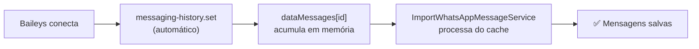
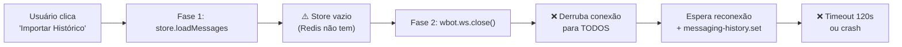

# Comparação: Import Conexão vs Import Ticket

## Resumo Executivo

| Aspecto | Import Conexão (✅ Funciona) | Import Ticket (❌ Quebrado) |
|---------|-------------------------------|------------------------------|
| **Serviço** | `ImportWhatsAppMessageService` | `ImportContactHistoryService` |
| **Fonte** | `dataMessages[id]` (memória) | `store.loadMessages` + `ws.close()` |
| **Trigger** | Modal "Editar Conexão" → Salvar | Menu ticket → "Importar Histórico" |
| **Risco** | Nenhum (dados já em memória) | **ALTO** (fecha websocket) |

---

## Por que o Import Conexão funciona?

**Fluxo simples e seguro:**
1. Baileys conecta e recebe history sync naturalmente
2. Mensagens ficam em `dataMessages[whatsappId]` (array em memória)
3. Quando o usuário clica "Salvar", processa tudo do array
4. Deduplicação por `wid` em chunks de 1000
5. Usa `Message.upsert()` direto (rápido)

---

## Por que o Import Ticket NÃO funciona?

### Problemas identificados:

1. **Fase 1 falha**: `store.loadMessages` depende do store em memória/disco. Com Redis, o store geralmente está vazio ou limitado.

2. **Fase 2 é destrutiva**: Chama `wbot.ws.close()` que:
   - Derruba a conexão para **TODOS** os tickets, não só o alvo
   - Pode causar `xml-not-well-formed` ao reconectar (o bug de Bad MAC!)
   - Compete com a lógica de reconexão automática do `wbot.ts`
   - Timeout de 120s → tela branca se não receber nada

3. **Verificação de duplicatas ineficiente**: Faz `findOne` por mensagem (N queries), enquanto o Import Conexão faz `findAll` em batch de 1000.

4. **Download de mídia**: Tenta baixar mídia de mensagens antigas → frequentemente falha porque os links expiram.

---

## Diferenças Técnicas Chave

| Critério | Import Conexão | Import Ticket |
|----------|----------------|---------------|
| Fonte de dados | `dataMessages[]` (já na memória) | `store.loadMessages` + `ws.close()` |
| Dedup | Batch `findAll` (1000/vez) | Individual `findOne` (1/vez) |
| Salvar msg | `Message.upsert()` | `CreateMessageService()` |
| Mídia | Não baixa (salva como chat) | Tenta baixar (falha em antigas) |
| Impacto conexão | **Zero** | **Derruba websocket** |
| JID handling | Resolve LIDs via store | Usa `contact.number` (pode ser incorreto) |
| Progresso UI | `importMessages-{companyId}` | `importHistory-{ticketId}` |

---

## Causa Raiz do Problema

> [!CAUTION]
> A **Fase 2** do `ImportContactHistoryService` chama `wbot.ws.close()` forçando reconexão. Isso é incompatível com a arquitetura atual porque:
> - A reconexão dispara `connection.update` que pode resetar o estado
> - O handler de `messaging-history.set` compete com o `wbotMonitor`
> - Em ambientes com múltiplas instâncias (Redis/HA), o socket pode ser recriado por outra instância

## Solução Recomendada

Reescrever o `ImportContactHistoryService` para usar a mesma estratégia do `ImportWhatsAppMessageService`:

1. Buscar mensagens do `dataMessages[whatsappId]` filtradas pelo `jid` do ticket
2. Se não houver mensagens em memória, usar `fetchMessageHistory()` do Baileys (API nativa, sem fechar socket)
3. Nunca chamar `wbot.ws.close()`
