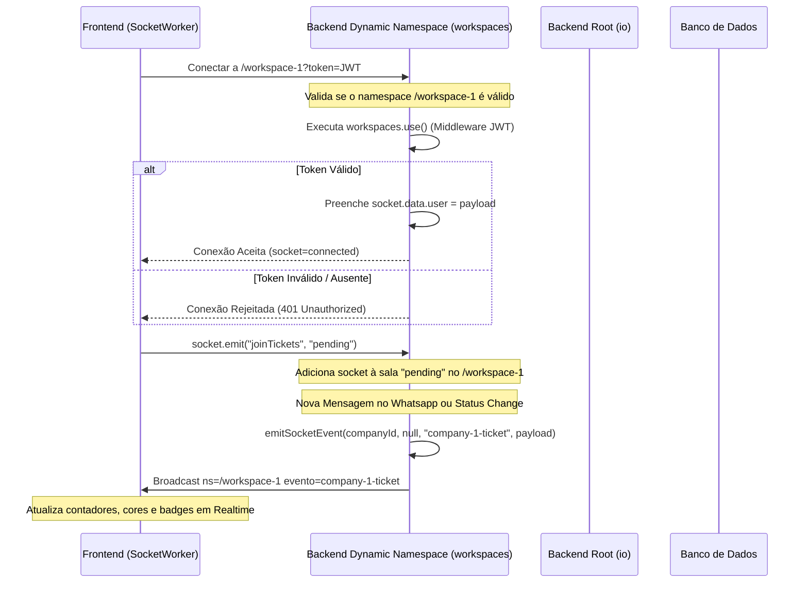
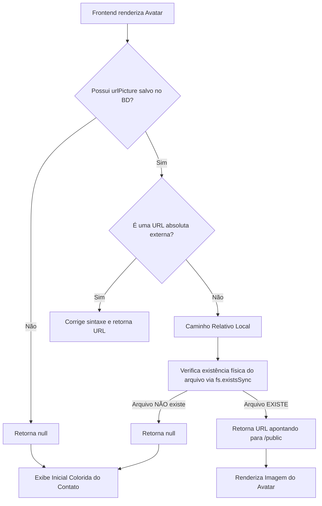

# Relatório de Diagnóstico e Correções: Sockets e Avatares

Este documento detalha o diagnóstico e a correção implementada para os dois problemas pontuais no Whaticket:
1. Sockets conectados que não atualizavam badges ou cores no frontend.
2. Avatares que não apareciam no frontend (erros 404).

---

## 1. Problema dos Badges / Sockets (Realtime)

### Diagnóstico
O backend do Whaticket foi modificado para utilizar namespaces dinâmicos baseados em padrão (ex: `/workspace-1`). O frontend se conectava diretamente a `/workspace-1`. 

No entanto, o middleware de autenticação JWT estava registrado com `io.use()` no namespace raiz (`/`) do backend. No Socket.IO v3+, middlewares registrados no namespace raiz com `io.use()` **só se aplicam a conexões direcionadas ao namespace raiz**. Eles **não** são executados para conexões diretas a namespaces secundários ou dinâmicos.

Como o frontend se conectava direto a `/workspace-1`, a autenticação JWT era inteiramente pulada. Além disso, `socket.data.user` (usado por várias partes para rastreamento de atividade do usuário) ficava indefinido.

### Correção Realizada
Adicionamos o mesmo middleware de validação JWT no parent namespace dinâmico `workspaces` (`workspaces.use(...)`) em [socket.ts](file:///c:/Users/feliperosa/whaticket/backend/src/libs/socket.ts). Isso garante que conexões dinâmicas sejam autenticadas e `socket.data.user` seja populado.

### Mapa de Fluxo do Socket.IO

---

## 2. Problema dos Avatares (Erros 404 / CORS)

### Diagnóstico
Os avatares dos contatos podem falhar ao baixar devido a falhas na sessão do WhatsApp, rate limit da API, ou exclusão da pasta física (por exemplo, após migrações).

O banco de dados continua com o caminho antigo da imagem (como `contact1450/1716940000000.jpeg` ou `contacts/uuid/avatar/avatar.jpg`). O getter virtual `urlPicture` no model `Contact` retornava a URL completa gerada, mesmo se o arquivo físico de imagem correspondente **não existisse no disco** do servidor.

Isso fazia o navegador tentar carregar a URL e receber erro **404 Not Found**. E o frontend exibia o ícone de imagem quebrada em vez de mostrar a inicial do contato colorida.

### Correção Realizada
Modificamos o getter `urlPicture` no model [Contact.ts](file:///c:/Users/feliperosa/whaticket/backend/src/models/Contact.ts) para fazer uma **verificação de existência física** no disco do servidor (`fs.existsSync`).
Se o arquivo local não for encontrado no servidor, o getter retorna `null`. O frontend, recebendo `null`, renderiza nativamente as iniciais coloridas do contato como fallback seguro, resolvendo o layout quebrado imediatamente.

### Mapa de Fluxo do Avatar (getter urlPicture)

---

## 3. Verificação do Build e Rollback

* **Build TS**: Confirmar se o backend compila normalmente (`npm run build`).
* **Mecanismo de Rollback**: Se houver qualquer comportamento estranho no Socket.IO, as configurações originais do `socket.ts` podem ser restauradas.
