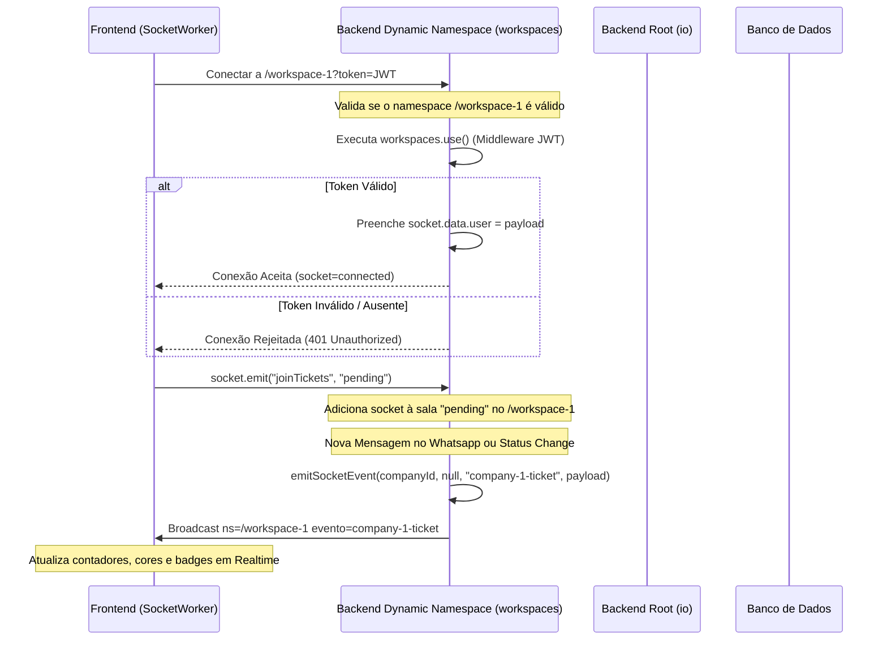
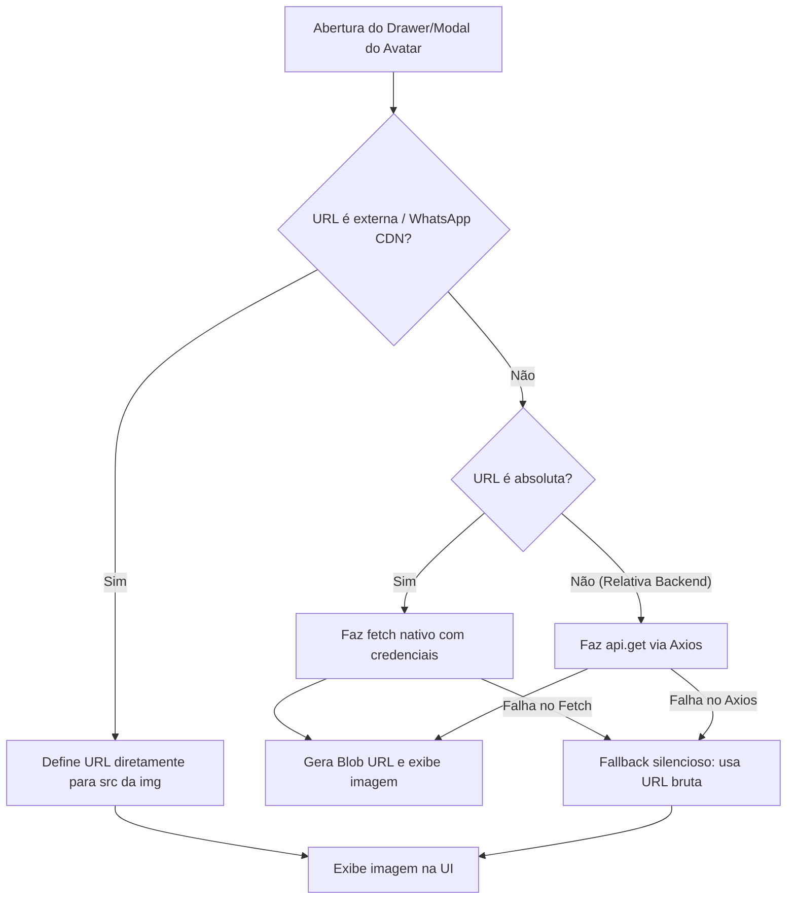

# Relatório de Diagnóstico e Correções: Sockets e Avatares

Este documento detalha o diagnóstico e a correção implementada para os problemas pontuais no Whaticket:
1. Sockets conectados que não atualizavam badges ou cores no frontend.
2. Avatares que não apareciam no frontend — bug crítico de `__dirname` no getter `urlPicture`.
3. Erros de CORS e "Network Error" no frontend ao tentar carregar avatares do CDN do WhatsApp.

---

## 1. Problema dos Badges / Sockets (Realtime)

### Diagnóstico
O backend do Whaticket foi modificado para utilizar namespaces dinâmicos baseados em padrão (ex: `/workspace-1`). O frontend se conectava diretamente a `/workspace-1`. 

No entanto, o middleware de autenticação JWT estava registrado com `io.use()` no namespace raiz (`/`) do backend. No Socket.IO v3+, middlewares registrados no namespace raiz com `io.use()` **só se aplicam a conexões direcionadas ao namespace raiz**. Eles **não** são executados para conexões diretas a namespaces secundários ou dinâmicos.

Como o frontend se conectava direto a `/workspace-1`, a autenticação JWT era inteiramente pulada. Além disso, `socket.data.user` (usado por várias partes para rastreamento de atividade do usuário) ficava indefinido.

### Correção Realizada
Adicionamos o mesmo middleware de validação JWT no parent namespace dinâmico `workspaces` (`workspaces.use(...)`) em [socket.ts](file:///c:/Users/feliperosa/whaticket/backend/src/libs/socket.ts). Isso garante que conexões dinâmicas sejam autenticadas e `socket.data.user` seja populado.

### Mapa de Fluxo do Socket.IO

---

## 2. Problema dos Avatares e Erros de Rede (404 / CORS / Axios Network Error)

### Diagnóstico
Os avatares dos contatos podem falhar ao baixar devido a falhas na sessão do WhatsApp, rate limit da API, ou exclusão da pasta física (por exemplo, após migrações).

1. **Erro de Existência Física (Backend)**: O banco de dados continua com o caminho antigo da imagem local. O getter virtual `urlPicture` no model `Contact` retornava a URL completa gerada, mesmo se o arquivo de imagem correspondente **não existisse no disco** do servidor, resultando em erro **404 Not Found** e imagem quebrada no frontend.
2. **Erros de CORS e Rede no Frontend**: Se o contato possuísse apenas a URL externa do WhatsApp CDN (`https://pps.whatsapp.net/...`), o frontend, especificamente nos componentes [ContactDrawer/index.js](file:///c:/Users/feliperosa/whaticket/frontend/src/components/ContactDrawer/index.js) e [ContactDrawer/ModalImage.js](file:///c:/Users/feliperosa/whaticket/frontend/src/components/ContactDrawer/ModalImage.js), executava requisições Axios (`api.get`) para a URL externa ao tentar exibir o avatar ampliado. Como o CDN do WhatsApp não libera CORS para origens externas arbitrárias, o Axios falhava com "Network Error". O interceptor global do Axios interceptava e disparava tentativas de retry infinito no console, finalizando com o popup vermelho `toastError("Error: Network Error")` na tela do usuário.

### Correção Realizada
1. **Verificação no Backend**: Modificamos o getter `urlPicture` no model [Contact.ts](file:///c:/Users/feliperosa/whaticket/backend/src/models/Contact.ts) para fazer uma **verificação de existência física** no disco do servidor (`fs.existsSync`). Se o arquivo local não existir, retorna `null`, permitindo ao frontend renderizar iniciais coloridas de fallback imediatamente.
2. **Blindagem do Frontend (Drawer e Modal)**: Atualizamos o carregamento de imagens no [ContactDrawer/index.js](file:///c:/Users/feliperosa/whaticket/frontend/src/components/ContactDrawer/index.js) e [ContactDrawer/ModalImage.js](file:///c:/Users/feliperosa/whaticket/frontend/src/components/ContactDrawer/ModalImage.js) para detectar URLs externas de CDNs e renderizá-las diretamente (sem realizar requisição Axios) e usando fallback silencioso de erro sem disparar popups desagradáveis.
3. **Interceptor Global do Axios**: Blindamos o interceptor global em [api.js](file:///c:/Users/feliperosa/whaticket/frontend/src/services/api.js) para que ele descarte tentativas de retry em URLs de rede que apontem para endereços externos ao backend principal (`REACT_APP_BACKEND_URL`).

### Mapa de Fluxo do Carregamento de Avatar (Frontend)

---

## 3. Verificação do Build e Rollback

* **Build TS**: Confirmar se o backend compila normalmente (`npm run build` no backend).
* **Verificação do Frontend**: Garantir que as alterações em JS comum no frontend não criaram nenhum erro de carregamento e estão isoladas.
* **Mecanismo de Rollback**: Se houver qualquer comportamento estranho no Socket.IO ou na exibição do avatar, os estados originais dos arquivos podem ser restaurados pelo controle de versão.
