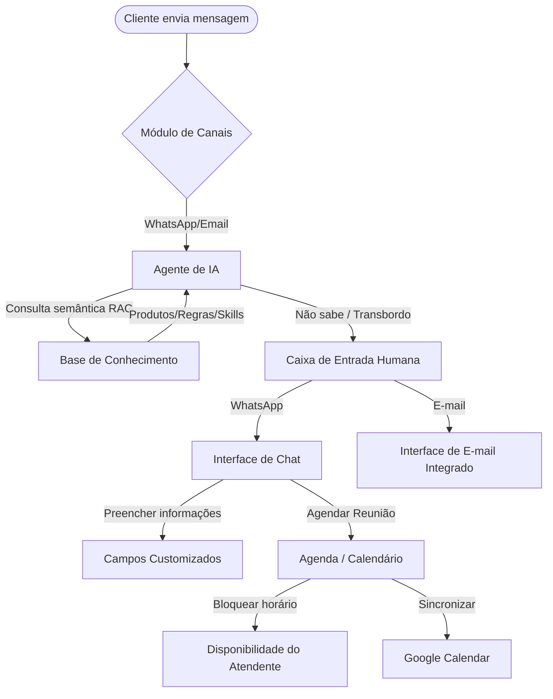

# Análise Detalhada de Fluxos: Sellflux para Whaticket

Este documento descreve detalhadamente o funcionamento de quatro módulos identificados no Sellflux: **Base de Conhecimento (IA/RAG)**, **E-mails (Inbox Integrada)**, **Agenda (Calendário)** e **Campos Customizados**.

---

## 🗺️ Mapa Geral de Fluxo dos Módulos

O diagrama abaixo descreve a relação lógica entre os módulos e como eles interagem entre si em um atendimento automatizado e humano:

---

## 1. Módulo: Base de Conhecimento (IA / RAG)

Este módulo é o coração da automação inteligente do Sellflux, servindo como "memória" para os robôs de atendimento.

### 📁 Estrutura Lógica (Banco de Dados e API)
A estrutura é dividida em duas entidades principais:
1. **Listas de Conhecimento (`knowledge-list`):** Funciona como "pastas" ou categorias de dados (Ex: *Produtos IA*, *Regras da Empresa*).
   * **API de listagem:** `/sacv1/knowledge-list/list`
2. **Itens de Conhecimento (`knowledge-item`):** São os documentos, textos ou regras cadastrados dentro de cada lista.
   * **API de CRUD:** `/sacv1/knowledge-item/create`, `/sacv1/knowledge-item/list?knowledge_list_id=541`, `/sacv1/knowledge-item/update`

### 🧠 Como Funciona o RAG (Busca Semântica)
Como visto na API `/sacv1/knowledge-item/create`, quando um texto é salvo, a plataforma gera e armazena **embeddings vetoriais** (`emb_title_v3_large` e `emb_body_v3_large`).
* **Funcionamento:**
  1. O atendente cadastra uma regra (Ex: *"Nossa garantia é de 7 dias"*).
  2. O sistema envia o texto para um modelo de embedding (como OpenAI Text-Embedding ou Gemini API) e salva os vetores resultantes no banco de dados.
  3. Quando o cliente pergunta no WhatsApp: *"Qual o prazo de reembolso?"*, o sistema transforma a pergunta em vetor e faz uma **busca vetorial** (cosseno de similaridade) no banco de dados.
  4. O documento mais similar é recuperado e injetado no prompt da IA como contexto para ela responder com segurança.

### 🛠️ Como aplicar no Whaticket:
* Adicione uma tabela `KnowledgeLists` (id, title, projectId) e `KnowledgeItems` (id, listId, title, content, embedding_vector).
* Utilize uma extensão como **PGVector** no PostgreSQL ou o SQLite Vector extension para fazer a busca semântica direto na Query SQL.

---

## 2. Módulo: E-mails (Ferramenta Completa)

Este módulo transforma a ferramenta em uma plataforma omnichannel de verdade, unificando e-mails e mensagens instantâneas.

### ✉️ Interface de Caixa de Entrada
* **Menu de Navegação:** Divisão clássica de abas: *Caixa de entrada*, *Com estrela* (Favoritos), *Enviados*, *Rascunhos*, *Arquivados*, *Spam*, *Lixeira* e *Todos os e-mails*.
* **Caixas Postais e Contas Externas:** O usuário pode conectar múltiplas contas corporativas externas (IMAP/SMTP).
* **API de Integração:** `/v2/email/user-integration-mailboxes`

### 🔗 Fluxo de Execução da Rede
As requisições interceptadas mostram a rota `/v2/email/threads`, o que significa que o sistema agrupa os e-mails por conversas (threads), assim como o Gmail faz.
* **API de listagem de conversas:** `/v2/email/threads?limit=30&page=0&order=desc`
* **Associação ao Lead:** A rota `/v2/email/resolve-recipient?entity_type=lead&entity_id=182732660` serve para cruzar o e-mail do lead com o histórico do CRM de forma automática.

### 🛠️ Como aplicar no Whaticket:
* Criar um microserviço em Node.js (utilizando bibliotecas como `imapflow` e `nodemailer`) para escutar caixas postais via protocolo IMAP (para entrada) e enviar via SMTP (para saída).
* Gravar os e-mails na tabela de `Messages` com o tipo `email` e a thread na tabela `Tickets` para que apareçam na mesma tela do atendente.

---

## 3. Módulo: Agenda (Calendário)

Uma agenda de compromissos interativa que vincula o cliente diretamente com o time de suporte/vendas.

### 📅 Interface e Visualizações (UI)
* **Visualizações:** Modo Calendário (visualização por dia, semana ou mês), Modo Lista (tarefas corridas) e Modo Kanban (estágio dos agendamentos).
* **Vínculos:** Cada compromisso pode ser associado a:
  * Um **Time** (departamento/atendente responsável).
  * Um **Lead** (cliente).
  * Um **Negócio** (CRM/Deal).
  * Um **Ticket** (suporte).
* **Filtros e Integrações:** Permite conectar com o Google Calendar para sincronizar horários e configurar bloqueios de horários do atendente (`sacv1/schedule-block`).

### ⚙️ Fluxo e Status do Agendamento
A API `/sacv1/schedule/pending` revelou as seguintes regras de negócios baseadas em status:
1. `scheduled` (Agendado)
2. `completed` (Concluído)
3. `no_show` (Não compareceu)
4. `canceled` (Cancelado)
5. `rescheduled` (Reagendado)
6. `overdue` (Atrasado/Pendente que passou do horário)

### 🛠️ Como aplicar no Whaticket:
* Adicionar tabela `Schedules` vinculada ao `ContactId` (Lead) e `UserId` (Atendente).
* Criar uma tela no frontend usando bibliotecas como **FullCalendar (React)** para renderizar o calendário por dia/semana/mês.
* Implementar a lógica de bloqueio de horários (`schedule-block`) para impedir agendamentos em horários em que o atendente já está ocupado ou fora do expediente.

---

## 4. Módulo: Campos Customizados

Permite estender os dados do Lead e do CRM sem precisar alterar o código-fonte toda vez que for necessária uma nova informação (Ex: CPF, Origem, CNPJ).

### 🏷️ Estrutura Granular por Entidades
A Sellflux divide os campos customizados em APIs dedicadas baseadas na entidade que os consome:
* `/v2/custom-fields/lead` (Campos do contato)
* `/v2/custom-fields/company` (Campos da empresa do contato)
* `/v2/custom-fields/deal` (Campos de oportunidades no funil de vendas)
* `/v2/custom-fields/ticket` (Campos de chamados de suporte)

### 🧩 Configuração e Tipagem de Campos
Como demonstrado no arquivo `/v2/custom-fields/lead?page=0&limit=20`, a estrutura de cada campo contém:
* `key`: O slug único do campo para buscas lógicas (Ex: `origen`).
* `label`: O rótulo visível para o atendente (Ex: `Origen `).
* `type`: Tipo do input (Ex: `text`, `number`, `select`, `date`).
* `config`: JSON de validações, ex: `{ "min_value": 0, "max_value": 100, "options": ["Instagram", "Google", "Indicação"] }`.

### 🛠️ Como aplicar no Whaticket:
* Criar tabelas:
  1. `CustomFieldConfigs` (id, entityType, key, label, type, config, projectId)
  2. `CustomFieldValues` (id, configId, entityId, value)
* No frontend, renderizar campos customizados de forma dinâmica na gaveta lateral de detalhes do contato lendo a lista de configurações.
