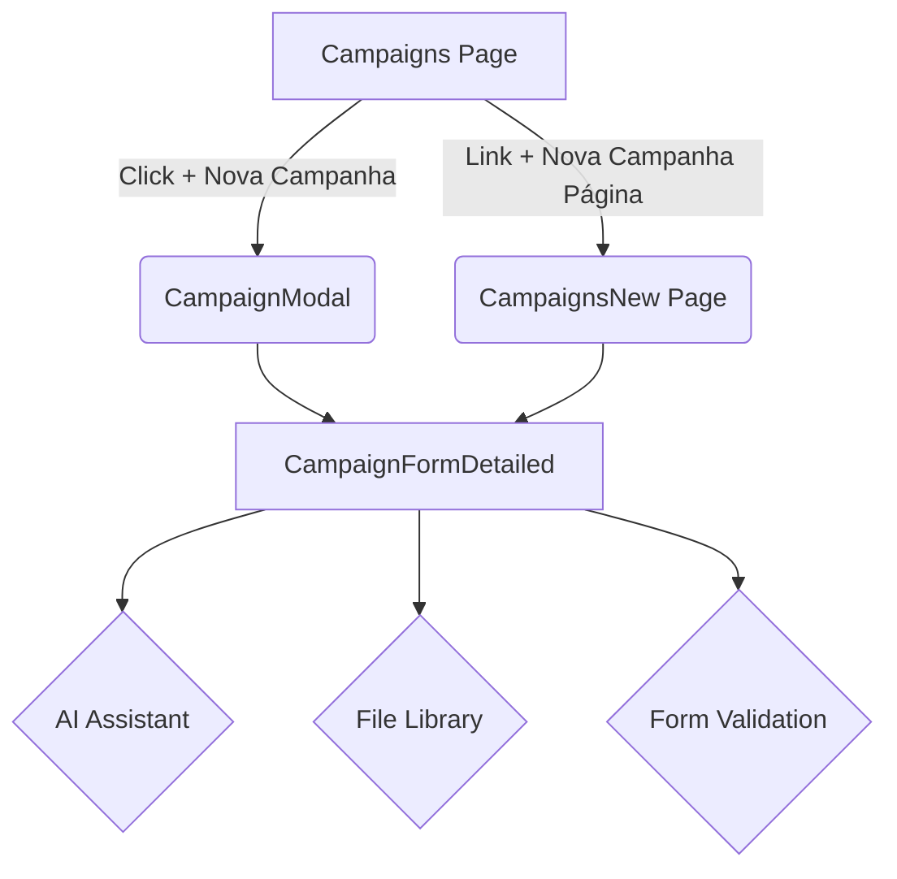

# Plano de Implementação - Replicação fiel do formulário de campanhas

O objetivo é transformar a página `/campaigns/new` em uma réplica fiel do modal de criação de campanhas (`CampaignModal`), garantindo que todas as funcionalidades (IA, anexos, abas de mensagens, previsualização) estejam presentes em ambos os lugares.

## User Review Required

> [!IMPORTANT]
> A refatoração envolverá a extração de uma grande lógica do `CampaignModal.js` (~2600 linhas). Para evitar duplicação de código, criaremos um componente base.
> Precisamos confirmar se a página `/campaigns/new` deve manter o cabeçalho "Voltar para Campanhas" ou se deve seguir o layout exato do modal.

## Fluxo de Componentes

## Proposed Changes

### Componentes de Interface

#### [NEW] [CampaignFormDetailed.js](file:///c:/Users/feliperosa/whaticket/frontend/src/components/CampaignFormDetailed/index.js)
- Criar um componente que contenha TODO o conteúdo atual do `CampaignModal` (Estados, Formik, Abas, Assistente de IA, Biblioteca de Arquivos).
- Este componente será agnóstico ao contêiner (pode estar em um Modal ou em uma Página).

#### [MODIFY] [CampaignModal](file:///c:/Users/feliperosa/whaticket/frontend/src/components/CampaignModal/index.js)
- Refatorar para ser apenas um invólucro de `Dialog` que renderiza o `CampaignFormDetailed`.
- Passar as props de fechamento e salvamento para o componente interno.

#### [MODIFY] [CampaignForm](file:///c:/Users/feliperosa/whaticket/frontend/src/pages/CampaignsNew/CampaignForm.js)
- Substituir o formulário simplificado atual pelo `CampaignFormDetailed`.
- Ajustar o layout para que ele preencha a página de forma harmoniosa (usando `MainContainer`).

---

## Detalhes Técnicos

1. **Unificação de Estados**: Mover todos os `useState` relacionados ao formulário (mensagens, anexos, templates) para o novo componente.
2. **Contextos e Hooks**: Garantir que `AuthContext`, `useQueues`, e outros hooks continuem funcionando no novo local.
3. **Estilo**: O `CampaignModal` usa muitos estilos customizados (`makeStyles`). Eles precisam ser movidos ou compartilhados.
4. **Funcionalidades Críticas**:
   - Assistente de IA (Sparkles).
   - Gerenciador de Arquivos (Library Manager).
   - Previsualização de WhatsApp.
   - Mapeamento de variáveis de Template.

## Open Questions

- Na página `/campaigns/new`, o botão de "Salvar" deve ficar fixo no rodapé (sticky) ou seguir o fluxo do formulário? No modal ele fica no `DialogActions`.
- Devemos permitir a edição de campanhas existentes também via página ou apenas o modal atual? (A rota `/campaigns/new` sugere apenas criação, mas poderíamos ter `/campaigns/:id/edit`).

## Verification Plan

### Automated Tests
- N/A (Build check para garantir que não há erros de importação/sintaxe).

### Manual Verification
1. Acessar `/campaigns` e abrir o modal de nova campanha.
2. Acessar `/campaigns/new` e comparar visualmente e funcionalmente.
3. Testar o Assistente de IA em ambos.
4. Testar a seleção de anexos da biblioteca em ambos.
5. Salvar uma campanha em ambos os locais e verificar se os dados foram persistidos corretamente no backend.
