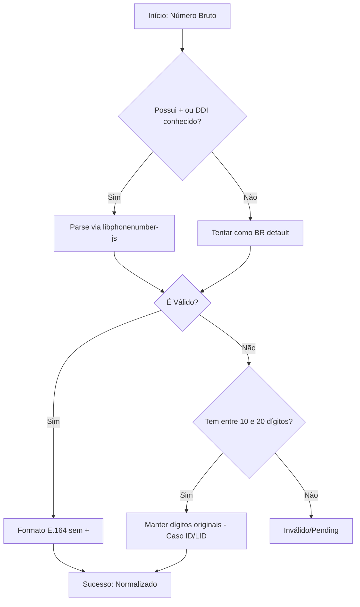

# Plano de Implementação - Correção de Duplicação de Contatos (libphonenumber-js)

Este plano visa resolver o problema onde respostas de clientes geram novos contatos duplicados ("Contato XXXXXX") através da implementação da biblioteca `libphonenumber-js` para normalização global e robusta, além de permitir IDs do WhatsApp com comprimentos não convencionais (até 20 dígitos).

## Fluxo de Normalização Híbrida

## Problema
- Travas rígidas de 10-13 dígitos invalidam IDs longos (14-15 dígitos).
- Falta de suporte para múltiplos DDIs de forma automatizada.
- Criação de contatos duplicados devido à falha na normalização/busca.

## Mudanças Propostas

### Backend

#### Inclusão de Dependência
- Instalar `libphonenumber-js` no backend.

#### [MODIFY] [phone.ts](file:///c:/Users/feliperosa/whaticket/backend/src/utils/phone.ts)
- Refatorar `normalizePhoneNumber` para usar `libphonenumber-js`.
- Remover as restrições fixas de 12-13 dígitos.

#### [MODIFY] [extractMessageIdentifiers.ts](file:///c:/Users/feliperosa/whaticket/backend/src/services/ContactResolution/extractMessageIdentifiers.ts)
- Aumentar o limite de validação de comprimento de 13 para 20 dígitos.

#### [MODIFY] [resolveContact.ts](file:///c:/Users/feliperosa/whaticket/backend/src/services/ContactResolution/resolveContact.ts)
- Ajustar buscas para permitir critérios de comprimento até 20 dígitos.

#### [MODIFY] [createContact.ts](file:///c:/Users/feliperosa/whaticket/backend/src/services/ContactResolution/createContact.ts)
- Ajustar `createPendingContact` para ser mais flexível com o comprimento do ID (10 a 20 dígitos).

#### [MODIFY] [CreateOrUpdateContactService.ts](file:///c:/Users/feliperosa/whaticket/backend/src/services/ContactServices/CreateOrUpdateContactService.ts)
- Relaxar a validação de comprimento máximo de 13 para 20 dígitos.

## Plano de Verificação

### Testes Automatizados
- Rodar build do backend (`pnpm run build`).

### Verificação Manual
1. Validar se IDs de 15 dígitos da campanha são preservados e associados.
