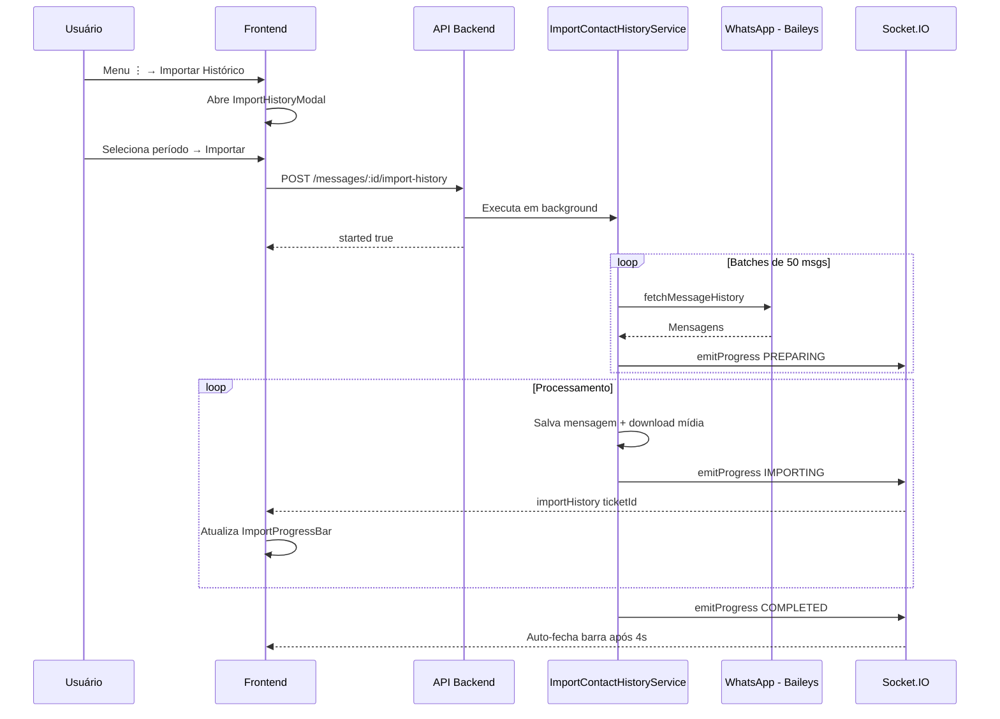

# Importação de Histórico de Mensagens do Contato

## Resumo

Feature que permite importar mensagens anteriores de um contato diretamente do WhatsApp para dentro do ticket. Disponível no menu ⋮ da toolbar do ticket.

## Arquivos Criados/Modificados

### Backend

| Arquivo | Ação | Descrição |
|---------|------|-----------|
| `ImportContactHistoryService.ts` | **NOVO** | Serviço de importação em batch via `fetchMessageHistory` do Baileys |
| `MessageController.ts` | MODIFICADO | Endpoint `importHistory` |
| `messageRoutes.ts` | MODIFICADO | Rota `POST /messages/:ticketId/import-history` |

### Frontend

| Arquivo | Ação | Descrição |
|---------|------|-----------|
| `ImportHistoryModal/index.js` | **NOVO** | Modal com RadioGroup para seleção de período |
| `TicketActionButtonsCustom/index.js` | MODIFICADO | Ícone `Download` + MenuItem "Importar Histórico" |
| `Ticket/index.js` | MODIFICADO | Listener socket + `ImportProgressBar` |
| `ImportProgressBar/index.js` | MODIFICADO | Permite exibir durante estado PREPARING |

## Fluxo de Dados

## Períodos Disponíveis

- **Último mês** (1 mês)
- **Últimos 3 meses**
- **Últimos 6 meses**
- **Histórico completo**

## Garantias de Integridade

### Prevenção de Duplicidade
O serviço verifica cada mensagem pelo ID único do WhatsApp (`wid`) antes de salvar. Se a mensagem já existir, ela é ignorada, prevenindo duplicatas.

### Ordem Cronológica
As mensagens são salvas com a data original (`messageTimestamp`). O frontend ordena automaticamente por data (`createdAt`), garantindo a posição correta no chat.

## Como Testar

1. Abrir um ticket WhatsApp
2. Clicar no menu **⋮** (três pontos) na toolbar
3. Clicar em **"Importar Histórico"** (ícone azul de download)
4. Selecionar período desejado
5. Clicar em **"Importar"**
6. Observar a barra de progresso glassmorphism no topo
7. Verificar mensagens importadas na conversa

## Suporte a Grupos e Correções Visuais (v2.0)

### Funcionalidades
- **Importação de Grupos**: Suporte total a importação de histórico de grupos, com detecção automática de sufixos (`@g.us`).
- **Visualização de Participantes**:
  - **Números Formatados**: Exibição amigável (ex: `+55 (11) 99999-9999`).
  - **Nomes Inteligentes**: Recuperação de nomes do perfil WhatsApp (PushName) e fallback para número formatado em vez de "Participante".
  - **Avatares**: Recuperação de fotos do perfil mesmo sem contato salvo (via Store).
