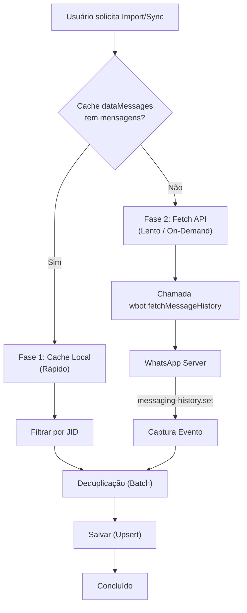

# Arquitetura de Importação On-Demand (Lazy Loading)

## Objetivo
Este documento descreve a nova lógica de importação de mensagens implementada para resolver problemas de travamento e queda de conexão (XML not well formed / Bad MAC) causados pelo download massivo de histórico.

## Problema Anterior
1. O sistema tentava baixar **todo** o histórico de **todos** os contatos na conexão inicial (`Importar mensagens do aparelho`).
2. O serviço de importação via ticket (`ImportService`) fechava o WebSocket (`ws.close()`) para forçar um re-sync, causando desconexões em cascata.
3. Não havia mecanismo de fallback quando o cache local (`store`) estava vazio (devido ao uso de Redis/PostgreSQL em vez de store em memória).

## Solução Implementada

Substituímos o modelo "Importar Tudo" por "Importar Sob Demanda".
O histórico só é baixado quando realmente necessário (ao abrir um ticket ou solicitar manualmente).

### Fluxo de Decisão

### Componentes Atualizados

#### 1. ImportContactHistoryService
- **Local:** `backend/src/services/MessageServices/ImportContactHistoryService.ts`
- **Lógica:**
  - Verifica `dataMessages[whatsappId]`.
  - Se vazio, usa `wbot.fetchMessageHistory` (API nativa do Baileys).
  - **NÃO** fecha mais a conexão WebSocket.
  - Timeout de 20s para evitar travamento.

#### 2. SyncChatHistoryService
- **Local:** `backend/src/services/MessageServices/SyncChatHistoryService.ts`
- **Lógica:**
  - Substituiu `store.loadMessages` (incompatível com Redis) por `fetchMessageHistory`.
  - Usa a mensagem mais antiga do banco como âncora para buscar o passado.
  - Implementa throttle de 5 minutos por ticket.

## Benefícios
1. **Estabilidade:** Conexão se mantém estável mesmo com milhares de contatos.
2. **Performance:** Banco de dados não é inundado com milhões de mensagens de contatos inativos.
3. **Usabilidade:** O sistema responde na hora para tickets recentes, e busca histórico apenas se o usuário pedir.
4. **Custo:** Menor uso de banda e processamento no servidor VPS.
