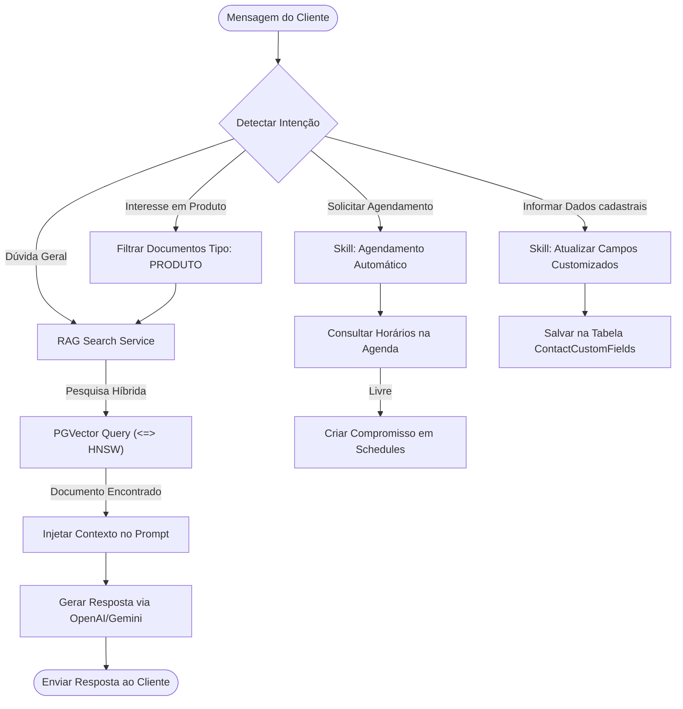

# Plano de Melhorias: IA e PGVector no Whaticket

Este documento descreve o estado atual da implementação da inteligência artificial e do **PGVector (RAG)** no backend do Whaticket, mapeia os recursos já existentes e propõe um plano de melhorias inspirado nas melhores funcionalidades da Sellflux.

---

## 🗺️ Mapa de Fluxo do RAG Atual e Proposto (Flow Map)

O diagrama abaixo ilustra o fluxo atual de busca semântica (RAG) no Whaticket e onde as melhorias propostas serão inseridas:

---

## 1. O que já temos implementado (E podemos aproveitar)

Nossa auditoria revelou que o Whaticket já possui uma infraestrutura de RAG extremamente avançada no diretório [`backend/src/services/RAG`](file:///c:/Users/feliperosa/whaticket/backend/src/services/RAG):

1. **Infraestrutura de Banco de Dados:**
   * Migrations ativas para criar a extensão `vector` no PostgreSQL.
   * Model [`KnowledgeChunk.ts`](file:///c:/Users/feliperosa/whaticket/backend/src/models/KnowledgeChunk.ts) mapeia a coluna de embeddings do tipo `vector(1536)` (adequada para OpenAI `text-embedding-3-small`).
   * Índice **HNSW** (`knowledge_chunks_embedding_hnsw`) configurado para buscas vetoriais por distância de cosseno (`vector_cosine_ops`) extremamente velozes.
2. **Motor de Busca Híbrido ([`RAGSearchService.ts`](file:///c:/Users/feliperosa/whaticket/backend/src/services/RAG/RAGSearchService.ts)):**
   * Realiza busca vetorial no Postgres através de queries SQL nativas utilizando o operador de distância de cosseno `<=>`.
   * Realiza busca textual clássica com suporte a Full Text Search (FTS) em português usando `to_tsvector` e `plainto_tsquery` para ponderar a relevância (Hybrid Search).
3. **Divisão de Textos Inteligente ([`SemanticChunker.ts`](file:///c:/Users/feliperosa/whaticket/backend/src/services/RAG/SemanticChunker.ts)):**
   * Chunker semântico implementado para dividir documentos em pedaços com base em limites lógicos de coesão semântica (similaridade entre sentenças) ao invés de cortes fixos de caracteres.
4. **Skills e Ações de IA ([`Skill.ts`](file:///c:/Users/feliperosa/whaticket/backend/src/models/Skill.ts) e [`ActionExecutor.ts`](file:///c:/Users/feliperosa/whaticket/backend/src/services/IA/ActionExecutor.ts)):**
   * Suporte nativo a categorias de habilidades, prioridades, intenções, triggers e execução de funções via IA.

---

## 2. Plano de Melhorias Práticas (Passo a Passo)

Aproveitando as bases de PGVector e IA do Whaticket e trazendo as ideias da Sellflux, estruturamos o seguinte plano de melhorias:

### 🚀 Melhoria 1: Categorização da Base de Conhecimento (Menu de IA)
* **Objetivo:** Separar documentos genéricos de informações de Catálogo de Produtos e Regras Institucionais da empresa.
* **Ação Técnica:**
  1. Alterar o model [`KnowledgeDocument.ts`](file:///c:/Users/feliperosa/whaticket/backend/src/models/KnowledgeDocument.ts) para incluir um campo `category` (ENUM: `general`, `product`, `rules`).
  2. Atualizar o [`RAGSearchService.ts`](file:///c:/Users/feliperosa/whaticket/backend/src/services/RAG/RAGSearchService.ts) para receber o filtro de categorias no RAG, permitindo que a IA foque a pesquisa semântica no catálogo de produtos quando o cliente pedir um preço, ou em regras institucionais quando pedir sobre reembolso.
  3. Adicionar na UI do Whaticket (Frontend) abas organizadas idênticas às da Sellflux: *"Produtos IA"*, *"Regras da Empresa"* e *"Documentos RAG"*.

### 📅 Melhoria 2: Skill de Agendamento Inteligente pela IA
* **Objetivo:** Permitir que o robô faça agendamentos de forma autônoma na agenda interna do Whaticket.
* **Ação Técnica:**
  1. No executor de ações de IA ([`ActionExecutor.ts`](file:///c:/Users/feliperosa/whaticket/backend/src/services/IA/ActionExecutor.ts)), criar a função `executeScheduling`.
  2. A função consultará a tabela `Schedules` e os bloqueios de horários do atendente responsável (usando a mesma lógica do `/sacv1/schedule-block` mapeado na Sellflux).
  3. A IA informará ao cliente quais horários estão vagos e, após confirmação, criará o registro de agendamento no banco de dados local.

### 🏷️ Melhoria 3: Skill de Captura de Dados e Preenchimento de Campos Customizados
* **Objetivo:** Ensinar a IA a mapear informações cadastrais informadas pelo cliente e alimentar a ficha dele.
* **Ação Técnica:**
  1. Em [`ActionExecutor.ts`](file:///c:/Users/feliperosa/whaticket/backend/src/services/IA/ActionExecutor.ts), criar a função `updateCustomFields`.
  2. Conforme o cliente informa dados durante a conversa (Ex: *"Meu CNPJ é 00.000.000/0001-00"* ou *"Meu orçamento é R$ 5.000"*), a IA reconhece a entidade, chama a função e salva o valor diretamente no model [`ContactCustomField.ts`](file:///c:/Users/feliperosa/whaticket/backend/src/models/ContactCustomField.ts) correspondente.
  3. O atendente humano verá esses campos já preenchidos no CRM do Whaticket de forma instantânea.

### ✉️ Melhoria 4: RAG aplicado à Caixa de Entrada de E-mails
* **Objetivo:** Permitir que a IA utilize a Base de Conhecimento em PGVector para responder e-mails recebidos de forma semi-automatizada ou automática.
* **Ação Técnica:**
  1. Integrar o serviço de recebimento de e-mails à fila de mensagens comum.
  2. Ao receber um e-mail, encaminhá-lo para o [`SendAIResponseService.ts`](file:///c:/Users/feliperosa/whaticket/backend/src/services/TicketServices/SendAIResponseService.ts).
  3. O serviço executará a busca vetorial na base de conhecimento e enviará uma sugestão de resposta (ou responderá de forma automática) via e-mail.
