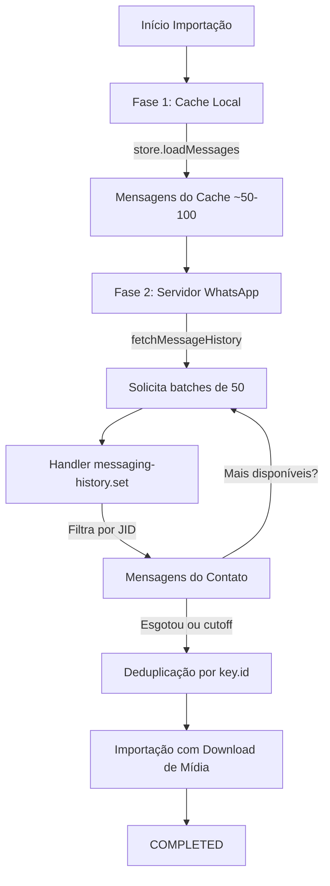
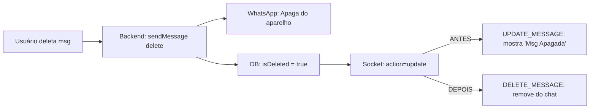

# Refatoração: Importação de Histórico com `fetchMessageHistory` do Baileys

## Problema Resolvido

Os botões "Importar Histórico" e "Ressincronizar Conversa" usavam apenas `store.loadMessages()` 
(cache local do Baileys), que contém ~50-100 mensagens recentes. 
Mensagens antigas do celular nunca apareciam no Whaticket.

## Solução: Duas Fases

## Tipos de Mensagem Importados

| Categoria | Tipos |
|---|---|
| Texto | `conversation`, `extendedTextMessage` |
| Mídia | `imageMessage`, `videoMessage`, `audioMessage`, `voiceMessage`, `ptvMessage` |
| Documentos | `documentMessage`, `documentWithCaptionMessage` |
| Stickers | `stickerMessage` |
| Contatos | `contactMessage`, `contactsArrayMessage` |
| Localização | `locationMessage`, `liveLocationMessage` |
| Reações | `reactionMessage` |
| Enquetes | `pollCreationMessage`, `pollUpdateMessage` |
| ViewOnce | `viewOnceMessage`, `viewOnceMessageV2`, `viewOnceMessageV2Extension` |
| Botões/Listas | `buttonsMessage`, `listMessage` e respostas |
| Efêmeras | `ephemeralMessage` |
| Editadas | `editedMessage`, `protocolMessage` |

## Bug Corrigido: Deleção de Mensagens

## Arquivos Alterados

- `backend/src/services/MessageServices/ImportContactHistoryService.ts` — Refatoração completa
- `frontend/src/components/MessagesList/index.js` — Fix deleção de mensagens
