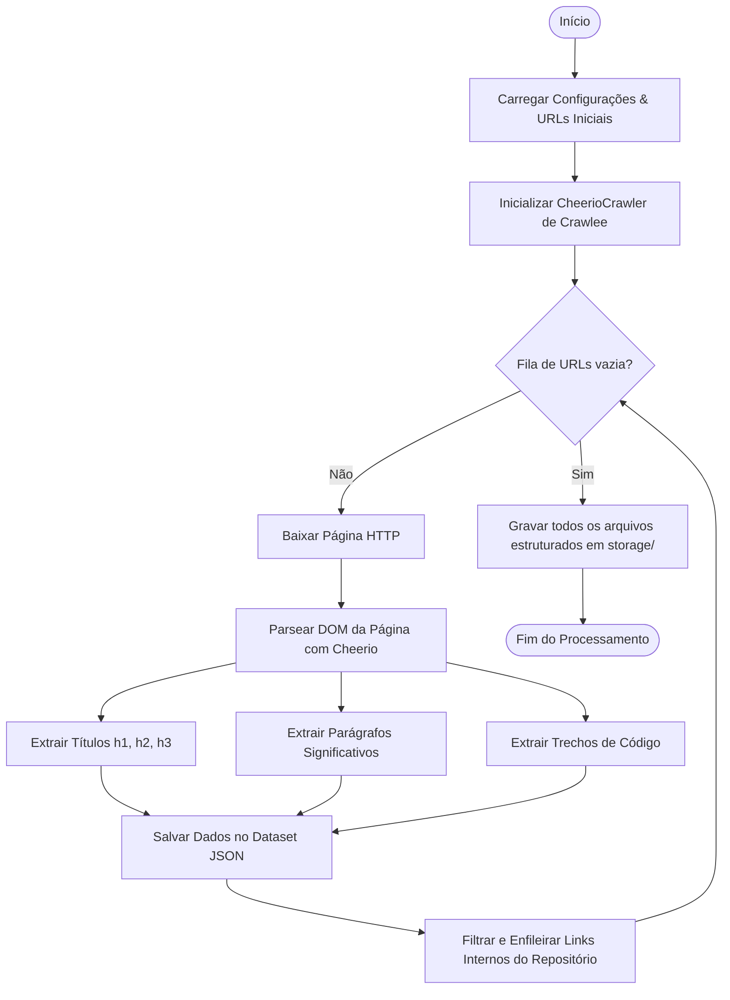
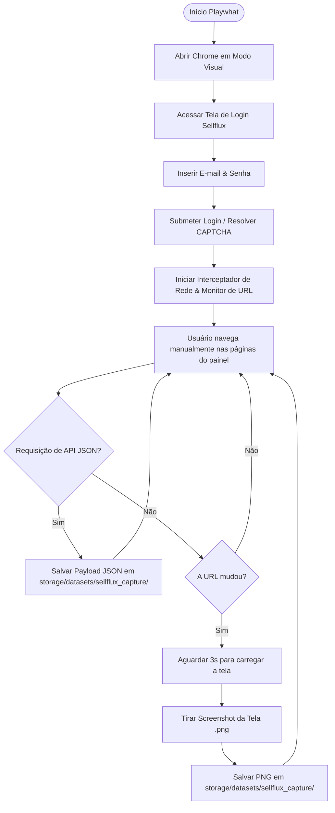

# Guia de Uso: Whaticket Web Scraper (Crawlee + TypeScript)

Este utilitário foi adicionado ao projeto para permitir a extração automatizada de código, recursos e documentação de outros repositórios (como projetos alternativos do Whaticket) com o objetivo de servir de inspiração e referência técnica para melhorias.

---

## 🗺️ Mapa de Fluxo (Flow Map)

O diagrama abaixo descreve o ciclo de vida da execução da raspagem de dados:



---

## 🌐 Módulo Playwhat (Captura Interativa de API e Layouts em Tempo Real)

Criamos um script interativo baseado em Playwright para realizar login no painel **Sellflux**, abrir o painel em modo visual, interceptar respostas de API de dados e **tirar capturas de tela (screenshots) automáticas** de cada página que você navegar.

### Mapa de Fluxo do Playwhat:



---

## 🛠️ Como Executar

O scraper está localizado na pasta `/scraper` na raiz do projeto. Ele funciona de forma totalmente independente e isolada para não afetar as dependências críticas do backend ou frontend do Whaticket.

### Passos para rodar a raspagem padrão (GitHub/Textual):

1. **Acessar a pasta do scraper:**
   ```bash
   cd scraper
   ```

2. **Garantir que as dependências estejam instaladas:**
   ```bash
   npm install
   ```

3. **Executar o Scraper padrão:**
   ```bash
   npm run dev
   ```

### Passos para rodar o Playwhat (Captura Interativa Sellflux):

1. **Acessar a pasta do scraper:**
   ```bash
   cd scraper
   ```

2. **Executar o script do Playwhat:**
   ```bash
   npm run playwhat
   ```

*(O navegador Chrome se abrirá de forma automática, fará o login no Sellflux e a partir desse ponto cada clique e página que você visitar terá seus dados de rede salvos na pasta local do projeto).*

---

## 📁 Onde os Dados são Salvos?

Os dados extraídos são guardados localmente:
* **Raspagem Estática Padrão:** Arquivos JSON em `scraper/storage/datasets/default/`
* **Módulo Playwhat (Sellflux):** Arquivos JSON (APIs de dados) e arquivos PNG (screenshots das telas e layouts correspondentes) salvos juntos em:
  * `scraper/storage/datasets/sellflux_capture/`
