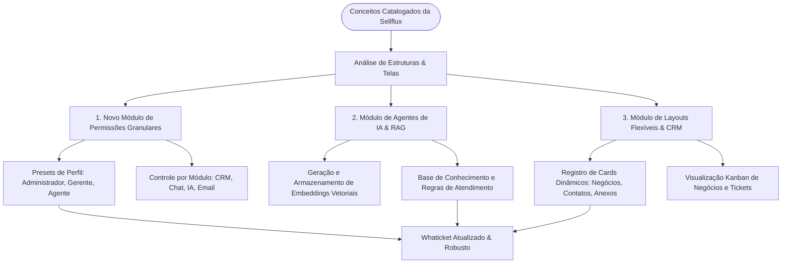

# Catálogo de Engenharia Reversa: Sellflux para Whaticket

Este documento cataloga a estrutura de APIs, os layouts mapeados através de screenshots e os fluxos lógicos capturados da aplicação Sellflux, organizados de forma a servirem de insumo técnico para melhorias no **Whaticket**.

---

## 🗺️ Mapa de Fluxo da Integração no Whaticket (Flow Map)

O diagrama abaixo descreve o plano de fluxo para importar os conceitos catalocados do Sellflux diretamente na arquitetura do Whaticket:

---

## 1. Catálogo de APIs e Estruturas de Dados (JSONs Importantes)

Abaixo estão listadas as principais APIs interceptadas que trazem lógicas estruturais cruciais para replicação:

### A. Permissões Granulares e Perfis (`team-permission/presets`)
* **Arquivo de Referência:** `api_response_328_1782831545390.json`
* **Rota:** `https://apiv4-main.sellflux.com/v2/team-permission/presets`
* **O que extrair:** Um mapeamento de perfis (`ADMIN`, `MANAGER`, etc.) atrelado a um array de controle contendo direitos (`read`, `write`, `delete`) por recursos da aplicação como:
  * `superuser`, `project`, `team`, `lead`, `products`, `sales`, `campaign`, `chat`, `kanban`, `tickets`, `email`, `calendar`, `funnel`.
* **Benefício para o Whaticket:** Permitirá substituir o controle binário de "Admin/User" do Whaticket original por um sistema robusto de controle de acesso baseado em papéis (RBAC).

### B. Gestão de Agente de IA e Base de Conhecimento RAG (`knowledge-item/create`)
* **Arquivo de Referência:** `api_response_260_1782831345251.json`
* **Rota:** `https://apiv4-main.sellflux.com/sacv1/knowledge-item/create`
* **O que extrair:** Estrutura de dados para criação de conhecimento atrelada a agentes de inteligência artificial. O payload revela o uso de vetores de embeddings longos para títulos e corpos do texto (`emb_title_v3_large` e `emb_body_v3_large`), indicando como a Sellflux faz a busca semântica para responder perguntas de clientes através da IA.
* **Benefício para o Whaticket:** Arquitetar um módulo onde o usuário possa cadastrar documentos e regras da empresa para um chatbot inteligente (RAG - Geração Aumentada por Recuperação).

### C. Registro Dinâmico de Cards e Widgets (`layout/card-registry`)
* **Arquivo de Referência:** `api_response_94_1782825051949.json`
* **Rota:** `https://apiv4-main.sellflux.com/v1/layout/card-registry?screen_type=lead`
* **O que extrair:** Um registro de componentes de UI (`deal_contact`, `integration_widget`, `lead_files`, `lead_attendances`) definindo quais áreas (`left`, `center`, `right`) e quais telas (`lead`, `deal`, `chat`, `ticket`) podem renderizar esses blocos.
* **Benefício para o Whaticket:** Permitir customização da área de detalhes do contato no chat, deixando que o usuário ative ou oculte campos customizados, anexos e integrações externas.

---

## 2. Catálogo de Layouts e Telas Mapeadas (Screenshots)

Os seguintes prints de tela foram obtidos e registram a disposição de elementos visuais do painel:

| Código da Imagem | Nome do Arquivo | Módulo do Layout | Detalhes do Layout Descoberto |
| :--- | :--- | :--- | :--- |
| **01** | `screenshot_13_chats.png` | **Chat Central** | Layout com listagem de chats, divisão por filas e visualização rápida do histórico de conversas do lead. |
| **02** | `screenshot_18_tickets_board.png` | **Quadro de Tickets** | Visualização em Kanban (estilo Trello) para organização de tickets de suporte em colunas por estágio. |
| **03** | `screenshot_25_funnel_ai_agents.png` | **Agentes de IA** | Interface de configuração dos Bots de Atendimento com seleção de comportamento e chaves de ativação. |
| **04** | `screenshot_26_funnel_pipelines.png` | **CRM / Pipelines** | Kanban de Negócios / Funil de Vendas conectando o lead do WhatsApp direto em uma jornada comercial. |
| **05** | `screenshot_27_funnel_automation.png` | **Automação** | Tela de construção de fluxos de automação disparados por eventos de mensagens ou tags. |
| **06** | `screenshot_36_whatsapp.png` | **Conexão WhatsApp** | Interface limpa e minimalista para escaneamento de QR Code e conexão de instâncias adicionais. |
| **07** | `screenshot_55_funnel_knowledge_rag.png` | **Base de Conhecimento (RAG)** | Gerenciamento de arquivos e textos que servem de base de dados para a inteligência artificial responder aos clientes. |

---

## 📁 Onde Encontrar os Arquivos Capturados

Todos os arquivos listados neste catálogo estão salvos no repositório local do projeto:
* **Pasta de Capturas:** [c:\Users\feliperosa\whaticket\scraper\storage\datasets\sellflux_capture](file:///c:/Users/feliperosa/whaticket/scraper/storage/datasets/sellflux_capture)
