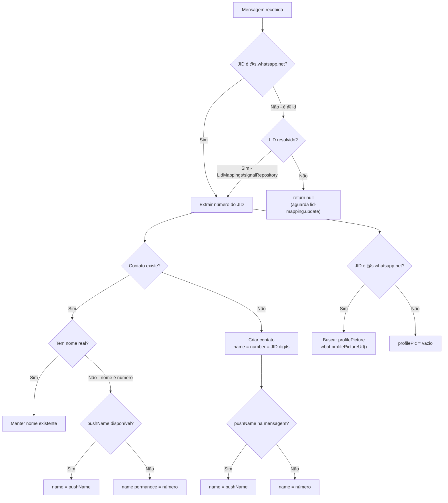

# Simplificação de Criação de Contatos — Apenas JID Real

## Regras de Negócio



## Mudanças Implementadas

### 1. `wbotMessageListener.ts` — verifyContact

**LID não resolvido = return null**
- Removidas ~120 linhas de criação de contato temporário LID
- Mantidas todas as estratégias de resolução (LidMappings, signalRepository, store.contacts)
- Se nenhuma resolver → mensagem ignorada (será processada quando lid-mapping.update resolver)

**Profile Picture proativa**
- Para JIDs `@s.whatsapp.net`, busca `wbot.profilePictureUrl()` ao criar contato

### 2. `CreateOrUpdateContactService.ts`

**pushName substitui nome-número automaticamente**
```typescript
if (pushName) {
  contact.pushName = pushName;
  const isNameJustNumber = !contact.name || currentNameClean === String(number);
  if (isNameJustNumber) {
    contactData.name = pushName;  // Substitui número pelo nome real
  }
}
```

**Guard contra LIDs**
- Rejeita números > 14 dígitos (formato de LID)
- Lança exceção para prevenir qualquer fluxo futuro de salvar LID como número

### 3. `wbotMonitor.ts` — lid-mapping.update

**Profile Picture ao promover contato**
- Quando contato PENDING_ é promovido a real, busca foto do Baileys usando JID real
