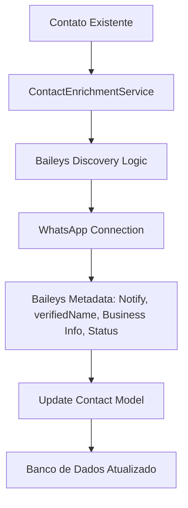

# Documentação Técnica: Enriquecimento de Contatos Baileys

## Visão Geral
Este sistema permite ao Whaticket capturar metadados profundos fornecidos pelo Baileys/WhatsApp que normalmente são ignorados durante o fluxo padrão de mensagens.

## Mapa de Fluxo

## Benefícios
- Recuperação de nomes (pushnames) retroativos.
- Identificação precisa de contas comerciais.
- Captura de fotos de perfil em alta definição.
- Monitoramento de status (About) e presença online.
