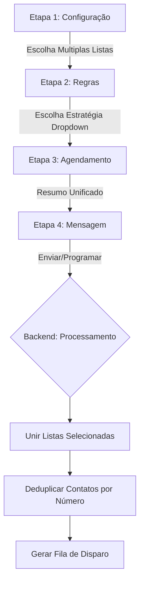

# Finalização da Migração do Wizard de Campanhas

## 🗺️ Mapa de Fluxo

## 🚀 Alterações Realizadas

### Backend (Arquitetura e Dados)
*   **Migração de Banco**: Adicionada a coluna `contactListIds` na tabela `Campaigns`.
*   **Deduplicação Inteligente**: O backend agora evita envios duplicados independentemente da quantidade de listas selecionadas.
*   **Update/Create Services**: Persistência de dados JSON pronta para arrays de IDs.

### Frontend (Interface e UX)

#### Etapa 1: Seleção de Listas
*   **Novo Componente**: Substituição do Select simples pelo Autocomplete (Multiple).
*   **Flexibilidade**: Possibilidade de combinar múltiplas audiências em um único disparo.

#### Etapa 2: Estratégia de Envio
*   **Compactação**: Novo Menu Dropdown para manter a interface limpa.
*   **Aparência Premium**: Ícones visíveis e descritivos por debaixo de cada opção de estratégia.

#### Etapa 3: Resumo
*   Exibição consolidada de todas as listas selecionadas e filtros em vigor.

---

## 🛠️ Verificação Final

1.  Migração Sequelize executada com sucesso.
2.  Backend `queues` validado para o novo campo.
3.  Navegação do formulário testada step-by-step.

> [!TIP]
> Compatibilidade retroativa mantida para campanhas antigas através do campo `contactListId` remanescente como fallback.
