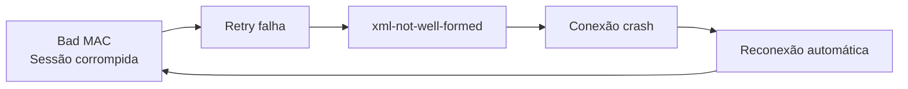
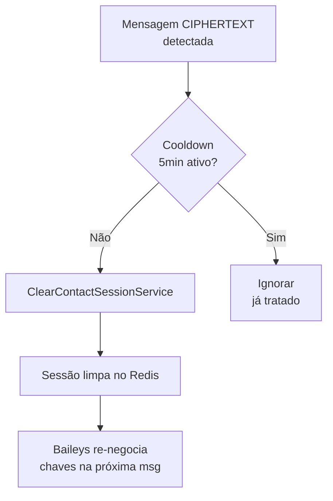

# Auto-Heal para Bad MAC / CIPHERTEXT

## Problema Raiz



A sessão criptográfica de `192126906318972@lid` estava corrompida, criando um **loop infinito** de crashes.

## Mudanças

### 1. Fix `wbotMonitor` — `wbot.ts`

```diff
-wbotMonitor(whatsapp, companyId, whatsapp.id);
+wbotMonitor(wsocket, whatsapp, companyId);
```

### 2. Auto-Heal — `wbotMessageListener.ts`



- `filterMessages` → `createFilterMessages(whatsappId)` (factory com closure)
- `badMacAutoHealMap`: cooldown de 5 min por `whatsappId:remoteJid`
- Usa `ClearContactSessionService` (suporte Redis)

## Logs esperados

```
WARN [AUTO-HEAL] Detectado Bad MAC para whatsappId=26, contact=192126906318972@lid. Limpando sessão corrompida...
INFO [AUTO-HEAL] Resultado: Sessão limpa com sucesso (redis): 3 arquivos removidos.
```
