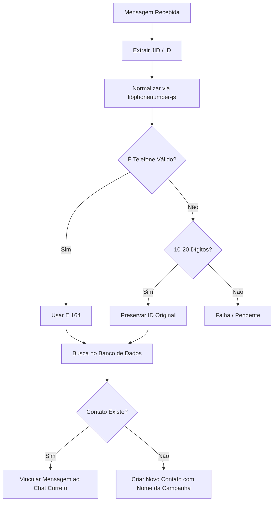

# Walkthrough - Solução de Duplicação de Contatos (IDs Longos)

Resolvemos o problema de duplicação de contatos ("Contato XXXXXX") implementando uma normalização de telefone robusta e global.

## O Que Foi Feito

### 1. Integração da `libphonenumber-js`
Substituímos a lógica manual de normalização por uma biblioteca homologada mundialmente. Isso permite que o Whaticket aceite números de qualquer país corretamente.

### 2. Normalização Híbrida
Implementamos uma regra que protege IDs especiais do WhatsApp:
- **Telefones Válidos**: Convertidos para o padrão E.164 (ex: 5511999999999).
- **IDs Meta/Cloud/LIDs**: IDs com 14 a 20 dígitos são preservados como estão, garantindo que não sejam invalidados e que a busca no banco funcione.

### 3. Relaxamento de Travas
Atualizamos 5 arquivos críticos de resolução de contatos para permitir comprimentos de até 20 dígitos (anteriormente limitados a 13).

## Arquivos Modificados
- `backend/src/utils/phone.ts` (Lógica central)
- `backend/src/services/ContactResolution/extractMessageIdentifiers.ts`
- `backend/src/services/ContactResolution/ContactResolverService.ts`
- `backend/src/services/ContactResolution/createContact.ts`
- `backend/src/services/ContactResolution/resolveContact.ts`
- `backend/src/services/ContactServices/CreateOrUpdateContactService.ts`

## Mapa de Fluxo

## Validação
- O build do backend foi executado com sucesso, garantindo que a nova biblioteca está corretamente integrada e os tipos documentados.
- As mudanças impedem que IDs longos (comuns em campanhas) gerem contatos genéricos e fiquem "órfãos" no painel.
