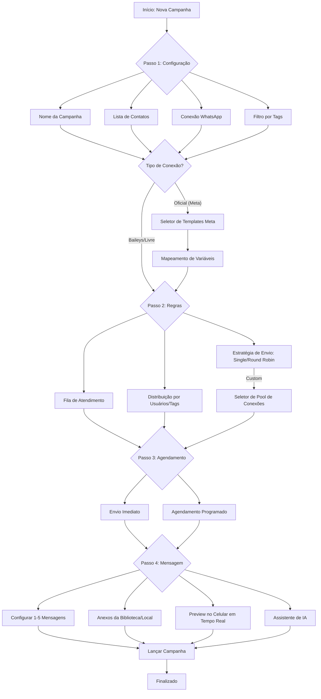

# Mapeamento do Fluxo de Criação de Campanha (Wizard)

O novo fluxo de criação de campanhas segue um processo de 4 etapas para melhorar a usabilidade e garantir que todas as configurações críticas sejam revisadas.

## Detalhes Técnicos do Wizard
- **Componente:** `CampaignForm.js`
- **Validação:** Formik + Yup (Validação por etapa).
- **Paridade:** 100% dos recursos do `CampaignModal` original foram portados para o novo layout de página.
