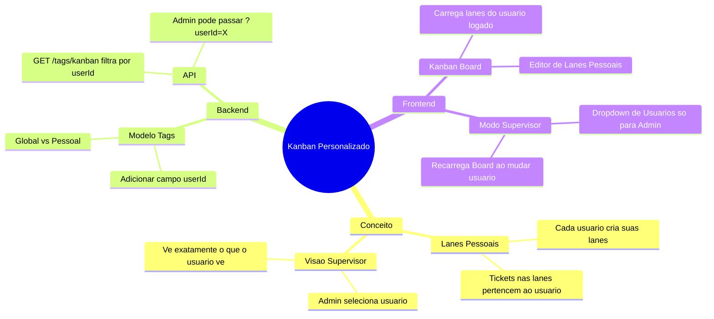

# Plano: Kanban Personalizado por Usuário

## Visão Geral
Transformar a área de Kanban ("CRM") em um workspace personalizado onde:
1.  **Usuários** gerenciam suas próprias colunas (lanes).
2.  **Supervisores/Admin** podem visualizar e gerenciar o Kanban de usuários específicos.

## Mapa Mental

## Arquitetura Proposta

### Dados (Banco de Dados)
A entidade base para Colunas/Lanes no Whaticket é a `Tag`. Vamos expandir esse conceito:

1.  **Tabela `Tags`**:
    *   Adicionar coluna `userId` (INTEGER, Nullable, FK -> Users).
    *   **Lógica**:
        *   `userId` IS NULL: Tag Global (ex: "Venda Concluída", "Lixeira"). Todos veem (ou configurável).
        *   `userId` IS NOT NULL: Tag Pessoal (ex: "Felipe - A Fazer"). Apenas o dono (e Admin) vê como lane.

2.  **Tabela `UserKanbanPreferences` (Opcional/Futuro)**:
    *   Armazena JSON com a ordem das lanes e quais tags globais o usuário quer ver.
    *   *MVP Inicial*: Ordenação baseada em campo na Tag ou alfabética.

### Backend

#### 1. Alteração na Tabela Tags (Migration)
*   Add column `userId` to `Tags`.

#### 2. Alteração no `TagController.kanban`
*   Modificar query para aceitar query param `?viewingUserId=X`.
*   **Permissão de Visualização**:
    *   Se `req.user.profile === "admin"`, pode visualizar qualquer ID.
    *   Se não, verificar se `req.user.managedUserIds` inclui `viewingUserId` OR se `viewingUserId === req.user.id`.
*   **Retorno**:
    *   Busca Tags Globais (`userId` IS NULL AND `kanban` = 1)
    *   OR Tags do Usuário Alvo (`userId` = `viewingUserId` AND `kanban` = 1).

### Frontend (User Interface)

#### 1. Kanban Header
*   **Seletor de Espaço de Trabalho (Dropdown)**:
    *   Visível para **Admin** ou **Usuários com managedUserIds > 0**.
    *   Opções:
        *   "Meu Espaço" (Default)
        *   Lista de usuários permitidos (Todos para Admin, `managedUserIds` para Supervisor).
    *   Ao selecionar: Recarrega Kanban passando `?viewingUserId=X`.

#### 2. Kanban Board
*   Renderiza colunas baseadas na resposta da API filtrada.
*   Permite editar/excluir lanes (Tags) que pertencem ao usuário (verificação se `tag.userId === user.id`).

## Estratégia de Implementação

1.  **Migration**: Adicionar `userId` em `Tags`.
2.  **Backend**: Ajustar `TagService/KanbanListService.ts` e `TagController.ts`.
3.  **Frontend**:
    *   Criar componente `UserSelector` no Header do Kanban.
    *   Ajustar chamada API para incluir filtro de visualização.
    *   Implementar modal simplificado de "Adicionar Coluna" que cria Tag Pessoal.

## Regras de Negócio
*   **Ticket Movimento**: Ao mover ticket para lane pessoal de Felipe, o ticket ganha a tag pessoal de Felipe.
*   **Visibilidade Ticket**: O ticket continua visível nas listas gerais, mas no Kanban ele aparece na coluna específica do Felipe.
*   **Conflitos**: Um ticket pode ter tags pessoais de múltiplos usuários? Sim. Ele apareceria no board de ambos? Sim, na respectiva coluna.

---
**Nota:** Este documento deve ser mantido na pasta `novapasta` para referência futura.
